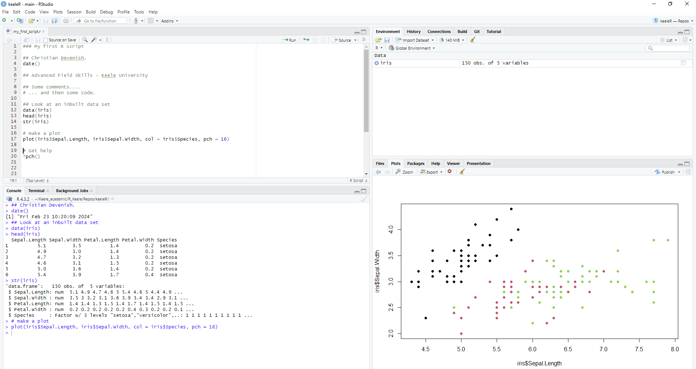
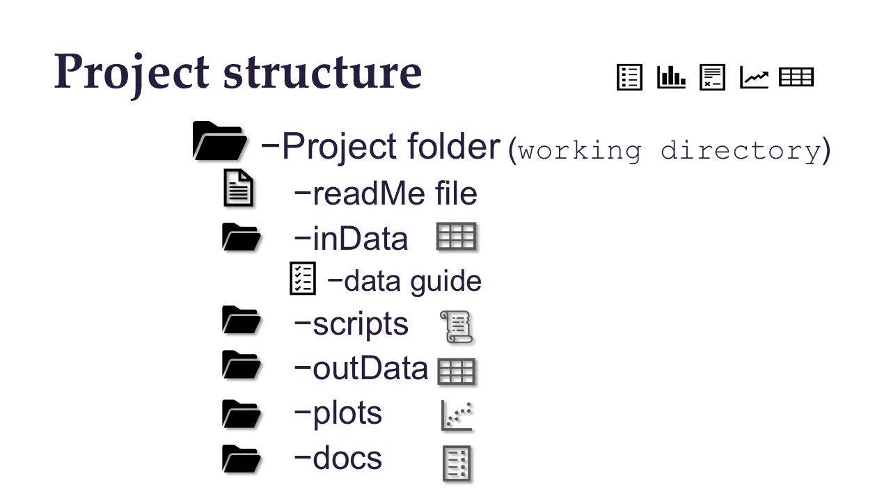

```{r setup, include=FALSE}
library(learnr)
knitr::opts_chunk$set(echo = FALSE)

```


## 1 First steps

### First steps in the console

R is a programming environment, but it's also like a calculator. The following code calculates the answer to 1 + 1. Hit the `Run Code` button, or use the keys `ctrl` + `enter` simultaneously, so that it performs the calculation.


```{r two-plus-two, exercise=TRUE}
1 + 1
```

Now change it so it calculates 2 + 2 and run the code. Note that you can use `ctrl` + `enter` in RStudio normally.

Well Done! You've just done your first calculation in R!!!


## 2 Data in R

### Looking at a data set

*Here's a data set that is included with R. It's called `iris`.*

`iris` is a `data.frame` - this is similar to a table in excel. It looks like this in excel:

{width=40%}


In R, the `head()` function shows you the first 6 rows of a data set. Run this code to see the first six lines of the `iris` data set:

```{r data_iris1, exercise=TRUE, exercise.eval=FALSE}

head(iris)

```

This data set contains measurements of sepals and petals of four different species of iris flower. The first four columns are the numeric measurements, and the last is the name of the species. 

The data set has 5 columns and 150 rows. You can see this with the function `str()`. This function is useful for checking your data after you import it. Run the code to see the structure of this data set: 

```{r data_iris2, exercise=TRUE, exercise.eval=FALSE}
str(iris)

```

The `str()` function tells you that the `iris` object is a `data frame` with 150 observations (rows) and 5 variables (columns), it shows you the column names, and the type of data in each column: `num` is numeric, for the measurements, and `Factor` is a categorical variable for the species name.

### Your turn!

*The `trees` data set is another inbuilt data set in R. Write code here to see the first 6 lines of the `trees` data set*

```{r trees1, exercise = TRUE}


```

```{r trees1-solution, exercise.reveal_solution = TRUE}

head(trees)

```

*Now use the `str()` to see how many rows and columns it has.*

```{r trees2, exercise = TRUE}


```

```{r trees2-solution, exercise.reveal_solution = TRUE}

str(trees)

```

### Quiz time!!

```{r quiz1}
quiz(
  question_numeric("How many rows does the trees data set have?",
                   answer(31, correct = TRUE)
  ),
  question("What are the names of the columns of the trees data set?",
    answer("Girth", correct = TRUE),
    answer("height"),
    answer("Volume", correct = TRUE),
    answer("Mass"),
    answer("Height", correct= TRUE)
  ),
  question_radio("What is the height of the third tree in the data set?",
                 answer(65),
                 answer(63, correct = TRUE),
                 answer(31),
                 answer(10.2),
                 answer(8.8),
                 random_answer_order = TRUE,
                 allow_retry = TRUE)
  
)
```


## 3 Creating objects

### Assigning values to objects in R

Data sets or groups of variables (often called objects) can either be created in R, or imported. Normally, we would begin by importing a data set from a text file, and then throughout the analysis we would create new objects, based on the original data. To create any object in R, we need to assign a **data value** to a **named object**. For example, we could create a variable called `data1` and give it a value of 10.

```{r objects1, exercise = TRUE, exercise.eval = TRUE}

data1 <- 10

```

If we type in the name of our object, and press run, we will see its value in the console. Type `data1` in the box below and press run.

```{r objects2, exercise = TRUE, exercise.setup = "objects1"}


```


Note that to assign the value of 10 to our new object `data1`, we have used an arrow pointing to the left ` <- `. This symbol is written as the `<` (less than) sign followed by the `-` (minus) sign without any spaces.

Your turn! Create an object called `data4` and give it a value of 25. Run your code and check that it's working by looking at the value assigned to `data4`.

```{r objects3, exercise = TRUE}


```

```{r objects3-hint-1}
data4 ...
```

```{r objects3-hint-2}
data4 <- ...
```

```{r objects3-hint-3}
data4 <- 25
```

## 4. Data import

### Importing data into R

The `iris` data set was already in R. However, most of the time, we will collect data, organise it in excel, and then import it into R. One of the easiest ways to do this is to save the excel spreadsheet as a `.csv` file and then import this.

*Here we have some data from a survey of oak galls on Pedunculate and Sessile oaks, surveyed at upland and lowland elevations in the UK. The data represent the number of galls found on trees of different heights (see below for full description).*

This is the data set in excel:

{width=60%}

The file has already been saved as `oak_galls.csv` and is located in a folder called `data`.

{width=50%}

We can use the `read.csv()` function to read the csv file into R. When we create a new object in R, we have to give it name. A sensible name is short, but descriptive of the data. Avoid using any punctuation in your name apart from underscores. Here, we will simply call the data set `oaks`.

Run the code to import the data. Note that the **path** to the file (where it is stored on your computer) is written in double quotes "".

```{r galls1, exercise = TRUE}

oaks <- read.csv("data/oak_galls.csv")

```

*Now use the `head()` and `str()` functions to check the data.*

```{r galls2, exercise = TRUE, exercise.setup = "galls1"}


```

```{r galls2-solution, exercise.reveal_solution = TRUE}

head(oaks)

str(oaks)

```

This data set has four variables (columns) and 60 observations (rows):  
- The `species` column contains the name of the species  
- The `terrain` column differentiates between lowland and upland sites  
- The `height` column give tree height in metres  
- The `galls` column gives the number of oak galls found on each tree  

## 5 Simple plots and functions

### Simple plots and accessing variables in data frames

One of the first things to do after importing and checking your data is to plot it. This is a further chance to spot any mistakes in importing it to R, and gives you a chance to start thinking about your research questions.

The most basic plot function is .... `plot()`!! We can use this to produce a scatter plot. For example, let's see if the height of the trees is related to the number of galls found on them.

```{r plot1, exercise = TRUE, exercise.setup = "galls1"}

plot(oaks$height, oaks$galls)

```

**Remember a scatterplot shows the relationship between two numeric or continuous variables**

Look at the above code. `oaks` is the name of the data frame, and `species` and `galls` are names of columns in the data frame. Note that we can access a column by using the `$` sign between the *dataframe name* and *column name*.

Write the code below to print the data in the `height` column. Run the code.

```{r plot2, exercise = TRUE, exercise.setup = "galls1"}

```

```{r plot2-solution, exercise.reveal_solution = TRUE}

oaks$height

```

### Using functions in R

We can apply functions to columns (also called vectors) of data frames. For example, what's the mean height of all the trees in the data set? Run the code to find out.

```{r mean1, exercise = TRUE, exercise.setup = "galls1"}

mean(oaks$height)

```

Now calculate the mean number of galls on all the trees. Write the code below and run it.

```{r mean2, exercise = TRUE, exercise.setup = "galls1"}

```


```{r mean2-solution, exercise.reveal_solution = TRUE}

mean(oaks$galls)

```

It might be useful to know the mean tree height for each species. We can use `tapply()` to apply a function (e.g. `mean()`) to each group within our data, e.g. to each species here. The different groups can be in a column of the same data set (e.g. `species`).

```{r tapply1, exercise = TRUE, exercise.setup = "galls1"}

tapply(oaks$height, oaks$species, mean)

```

Note that the tapply function has three components:
1. The data you want to apply the function to - in the example above, the tree heights (`oaks$height`)
2. The group identifier, in this case, this is the column that shows us which species each measurement is from (`oaks$species`)
3. The function we want to apply to the data, in this case, the mean of the heights (`mean`)


*Your turn*

Can you show the mean number of galls per species? 

```{r tapply2, exercise = TRUE, exercise.setup = "galls1"}

```

```{r tapply2-solution}

tapply(oaks$galls, oaks$species, mean)

```


Can you show the mean number of galls per upland or lowland region?

```{r tapply3, exercise = TRUE, exercise.setup = "galls1"}

```

```{r tapply3-solution}

tapply(oaks$galls, oaks$terrain, mean)

```

**Bonus** If the function for standard deviation is `sd()`, how would you show the standard deviation of galls for each upland or lowland region? Try it in the box above!

## 6 More plots

### More simple plots

Here is a boxplot of tree species height, separated by species. In the boxplot, this shows us the median height of each species. Run the code to see the plot:

```{r boxplot1, exercise = TRUE, exercise.setup = "galls1"}

boxplot(height ~ species, data = oaks)

```

What does the above boxplot tell you?

**Remember a boxplot shows the relationship between a numeric or continous and a categorical variable**

By copying and adapting the above code, can you draw a boxplot to show how gall number compares between upland and lowland observations. Write your code in the box below and press run to see the boxplot.

```{r boxplot2, exercise = TRUE, exercise.setup = "galls1"}

```


```{r boxplot2-solution, exercise.reveal_solution = TRUE}

boxplot(galls ~ terrain, data = oaks)

```


## 7 Scripts and projects in RStudio

### Writing scripts - the key to using R effectively!

Every time you use R, you should write your code in a **script** and save this in the folder for a particular data analysis, project, assessment, lesson, etc. 

Your scripts are simple text files - here you will write your commands and functions before you run them. Remember to write your name, date started, name of your project at the beginning.
As you write your code, write plenty of comments like this:

```{r commentExample, exercise = TRUE}

### This is a comment. Comments always start with one or more hash # symbols.

```

Comments will remind you later what you were doing. If you come back to a script at a later date you will be very thankful for all your comments!!!!

You can create a new script in the file menu on RStudio. Before we work on a script, have a look at each of the windows in RStudio:

### Getting to know R and RStudio

RStudio is another piece of software that many people use to run R in. R is actually a separate software that also works on its own, however, RStudio makes certain aspects easier. 

*Here's a screen shot of the default RStudio layout that you will see if you have just installed it.*

{width=80%}

$\\$
You can change the layout of the windows and the colour of the code and background - which may it easier to see the code. But for the moment, we'll continue with the default settings.

Let's look at each window:

#### Top left: **Script window**
{width=60%}
$\\$
This window is where your script normally is. You will always write in your script, and save it, so that you keep a record of your analysis.

#### Bottom left: **Console window**
{width=60%}
$\\$
This is the console. Here you will see the results of your analysis, but you generally won't write or copy text from here.

#### Top right: **Environment window**
{width=60%}
$\\$
This window shows your 'environment', that is all the objects or functions you have loaded at the moment (we'll learn about those later). It's important that this is always clear at the beginning of a session. Remember to clear everything out before you start.

#### Bottom right: **Files/Plots/Help window**
{width=60%}
$\\$
This is where you will see plots or help files for functions. You can navigate between these windows using the tabs at the top. You can also see your folders and files here, like in a windows explorer window.


### Working directories - the key to organising your work

We will implement a project structure for each class or analysis we do - good habits start early!!

A simple project structure consists of a project folder (the working directory) containing data, scripts, and information about the project, each within different folders. To help you keep track, it is easier to keep the same folder names (apart from the project name) for each project.

{width=60%}  

$\\$
See [The Project Tier protocol](https://www.projecttier.org/tier-protocol/protocol-4-0/root/) for a more detailed structure, but the above is good for now.

The working directory is the top (or root) folder. You can check what your current working directory is in R. Run this code to see. Note that this is an unusual location for a working directory as we are in a tutorial.

```{r wd_get, exercise = TRUE}

getwd()

```

You can set a working directory using the `setwd()` function. Put the path to the working directory inside the function, inside quotes. You can try this later when we set up a project on your computers outside this tutorial.


To avoid having to set the working directory each time, you can create a project in RStudio inside your project folder. As well as other advantages of working with projects (e.g. keeping different analyses separate, and saving your open scripts each time), RStudio will automatically set your working directory each time you open your saved project.

We will create a working directory and a project structure after this tutorial. But first, try working from a script in RStudio instead of working within this tutorial.

### My first script

Copy this code: `openScript(script = "my_first_script.r")` and then stop the tutorial by closing the window (x in top right corner). Paste the code into the console in RStudio and run it! Your first script should open. Before you do anything else save it on your computer in your class folder. Then continue to follow the instructions in the script.

If that doesn't work, download the "my_first_script.r" from the KLE and continue in Rstudio, as above.

