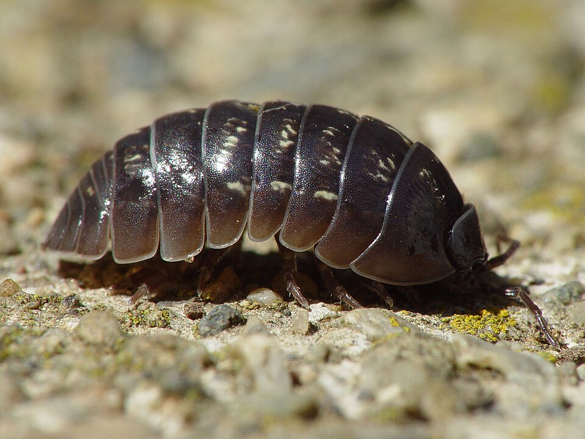
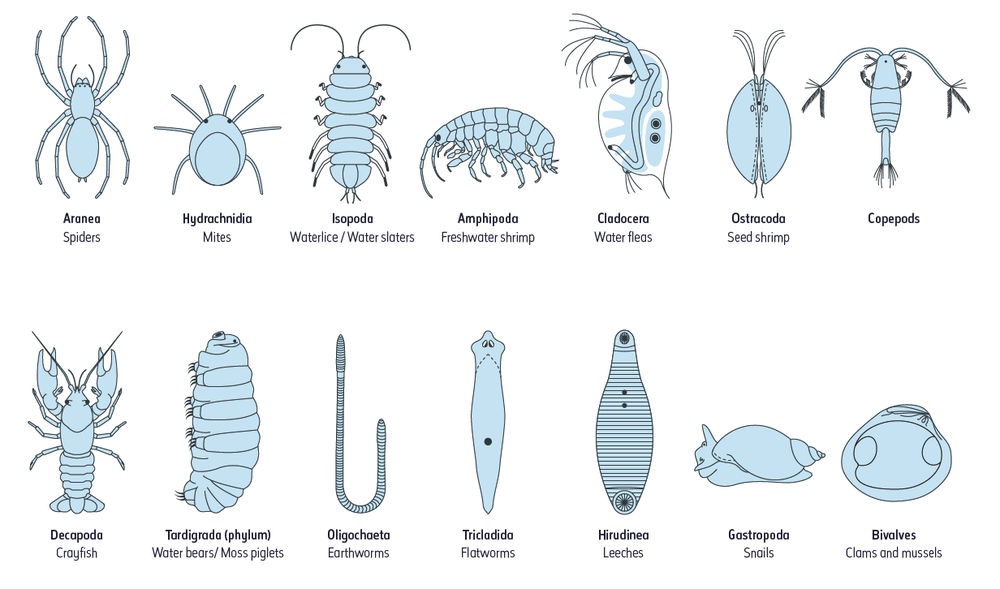

```{r setup, include=FALSE}
library(learnr)
knitr::opts_chunk$set(echo = FALSE)
```


## Associations between two categorical variables

### Example analysis

**Here's an example analysis using the six step workflow **

We are interested in whether a habitat preference exists for soil types in two genera of woodlouse (Arthropoda | Malacostraca | Isopoda). We have collected data from 5cm depth soil quadrats and counted the woodlice genera at sites with clay soil and chalk soil. For this analysis we have summed the counts of each woodlouse genus in each soil type. This kind of table is often known as a *contingency table*. In our case it is a *2 x 2* contingency table, that is, it has 2 rows, 2 columns.  

&nbsp; | Oniscus | Armadillidium
:------------- | :-------------: | :-------------:
**Clay soil** | 14  | 6
**Chalk soil** | 22  | 46


{width=60%}
  

We're going to follow the steps of the analysis protocol to answer question.

#### 1 *Ask your question*

Our research question: Is there a habitat preference for either clay or chalk soil in two genera of woodlouse. 

#### 2 *Check and explore your data*

First, as always, we need to import our data. Note that in this case, we are using the first column of the table in the `.csv` file as our row names. This will make it easier later on for our analysis. 

Run this box to import the data from the `.csv` file:
```{r wdlice_import, exercise = TRUE}
# Import the data
woodlice <- read.csv("./data/woodlice.csv", row.names = 1)

```

Run the following code to see the woodlice data.frame. You will see the row names with the soil type, and genus names as the columns.

```{r run_woodlice, exercise = TRUE, exercise.setup = "wdlice_import"}

woodlice

```

Let's check we understand our data. Look at the variables and their data types and then answer the questions.

```{r quiz1}
quiz(
  question_radio("What are the variable names",
                 answer("Soil type, Woodlouse genus", correct = TRUE),
                 answer("Clay soil, Chalk soil, Oniscus, Armadillidium"),
                 answer("Woodlouse, Clay, Chalk"),
                 answer("Oniscus, Armadillidium, Soil"),
                 random_answer_order = TRUE,
                 allow_retry = TRUE),
  question_radio("What is the data type of the Soil type variable?",
                 answer("Categorical", correct = TRUE),
                 answer("Numeric"),
                 answer("Count"),
                 answer("Logical (True or False)"), 
                 random_answer_order = TRUE,
                    allow_retry = TRUE),
    question_radio("What is the data type of the Woodlouse genus variable?",
                 answer("Categorical", correct = TRUE),
                 answer("Numeric"),
                 answer("Count"),
                 answer("Logical (True or False)"), 
                 random_answer_order = TRUE,
                    allow_retry = TRUE),
   question_checkbox("Tick the levels of the 'Soil type' variable?",
                 answer("Clay soil", correct = TRUE),
                 answer("Oniscus"),
                 answer("Chalk soil", correct = TRUE),
                 answer("Soil type"),
                 answer("Armadillidium"),
                 answer("Woodlice"),
                 random_answer_order = TRUE,
                    allow_retry = TRUE)
)

```

We're going to change our `data.frame` into a `matrix`. This will help us with a later plot, and we can also add the variable names. Run the code below.  
- The first line changes the data.frame into a matrix.  
- The second line adds the variable names (with the names of each level).  

**R-tip** A `matrix` is similar to a `data.frame` or excel spreadsheet, but an important difference with a `data.frame` is that all the columns have to be the same column type, e.g. text or numbers.

```{r add_dimnames, exercise  = TRUE, exercise.setup = "wdlice_import"}
woodlice <- as.matrix(woodlice)
dimnames(woodlice) <- list("Soil type" = c("Clay soil", "Chalk soil"),
                              "Woodlice genus" = c("Oniscus", "Armadillidium"))
```

Run the `woodlice` object again to see how it looks different. Check that you can see the variable names and their levels.
```{r check_matrix, exercise = TRUE, exercise.setup = "add_dimnames"}

```

```{r check_matrix-hint-1}

# run the object! Don't overthink!
woodlice 

```

Let's do a simple plot of the data. We will come back to this later to add an extra element to this plot to help interpret our results.  
The size of the boxes is proportional to the counts of woodlice per soil type. From looking at this plot, we can see easily that there were more *Oniscus* in Clay soil and more *Armadillidium* in Chalk soil. We can also see that we had higher counts in Chalk soil than Clay soil. Look back at the table to corroborate this. 


```{r mosaic_plot_grey, exercise = TRUE, exercise.setup = "add_dimnames"}

mosaicplot(woodlice,
           main = "", 
           color = TRUE)

```

-3 *Write your Null Hypothesis - H0*   
Writing the Null Hypothesis now will help us with the interpretation of our results later. Remember the H0 is always of no effect, no association, no relationship, no difference, etc.

**H0: There is no association between soil type and woodlouse genus.**  
In other words, woodlouse presence is independent of soil type.

-4 *Decide on your stats test*

Now that we know that we have two categorical variables, we have a table of counts and we are interested in investigation a possible association between these two categorical variables, we can conclude that a Chi-square test is appropriate.   

*Check out the flow charts for deciding on stats tests on the KLE!*

-5 *Do test and check significance value*

To run a Chi-square test for association we use the `chisq.test()` function. If we already have a contingency table (we do!), then we can simply put our table into the function without any other argument.  

Put `woodlice` into the `chisq.test()` and run it.
```{r chitest, exercise=TRUE, exercise.setup = "add_dimnames"}


```

```{r chitest-hint-1}
# Use this function with your data frame inside it
chisq.test() 
```

```{r chitest-solution, exercise.reveal_solution = TRUE}

chisq.test(woodlice)


```

Look at the results of the test. You have the following components:  
- Chi-squared value (X-squared)  
- Degrees of freedom (df): (number of rows - 1) x (number of columns - 1)   
- p-value

Remember our rule for interpreting the test? If the p-value is less than our threshold (0.05), then we reject the H0.

```{r quiz2}
quiz(
  question_radio("Are we going to reject the Null Hypothesis?",
                 answer("Yes", correct = TRUE),
                 answer("No"),
                 random_answer_order = TRUE,
                 allow_retry = TRUE)
)
```

So we can conclude that there is an association between soil type and woodlice genus. However, we haven't really answered the part of our question of real ecological interest. We want to know what kind of association. Which genus is associated with which soil type? We need to look further into the results to answer this. The concept of residuals and a plot will help us with this.

**Residuals**   
First, we need to think about an important concept in statistics known as **residuals**.

A general concept in statistics is that we look at a difference between our **observed values** and some **expected values** that we have generated, with basis on our test or expectations. For example, here our expected values would be the counts of woodlice that we would expect if there were no association between the woodlice and soil type, that is, if any variation in counts of woodlice in different soil types were just down to random chance. In another example, expected values could also represent the values that our data would take if they followed a straight line relationship, for example in a regression analysis.
Residuals are based on the difference between our **observed values** and our **expected values**. How big the difference is between these values gives us an idea of whether our data conform to our theory behind the expected values (e.g. random chance, or a straight line relationship, from above). If the difference is very large, then we might conclude that our data do not conform to the theory on which our expected values was based.
Also, whether the **observed values** are greater or less than the **expected values** provides information about the direction of a relationship. 

Let's get back to our data to illustrate this. We can see the observed values of our data in the original table. They are also present in the output of the chi-square function.

Let's check that. Run the `chisq.test()` function with the `woodlice` data again, but this time, assign the result to an object called `chi_result`.

Write the code here and run it.
```{r chi_sq_output, exercise = TRUE, exercise.setup = "add_dimnames"}

```

```{r chi_sq_output-hint-1}

# Use the 'assign arrow' <-

```

```{r chi_sq_output-hint-2}
# Remember, you assign the value of the right-hand side of the arrow
# to the object you have named on the left-hand side of the arrow

NAME_OF_YOUR_NEW_OBJECT <- DATA_TO_ASSIGN_TO_YOUR_NEW_OBJECT

```

```{r chi_sq_output-hint-3}
# Assign the value of the right-hand side of the arrow
# to the object on the left. Rename your object!

NAME_OF_YOUR_NEW_OBJECT <- chisq.test(woodlice)

```


```{r chi_sq_output-solution, exercise.reveal_solution = TRUE}
chi_result <- chisq.test(woodlice)

```

If you run your new object, `chi_result`, you will see the same results as above. Try it here:

```{r fix1, echo = FALSE, include = FALSE, exercise.setup = "add_dimnames"}
chi_result <- chisq.test(woodlice)

```

```{r run_chi_res, exercise = TRUE, exercise.setup = "fix1"}

```

```{r run_chi_res-solution, exercise.reveal_solution = TRUE}

chi_result

```

However, this object contains more information. We can look at the **observed values**, for example. These are the same as our original table.

```{r chi_res_obs, exercise=TRUE, exercise.setup = "fix1"}

chi_result$observed

```

We can also look at the **expected values**. These are the numbers each woodlice genera if their distribution was independent of soil type, i.e. if it was just down to chance. Change `$observed` for `$expected` in the above code and try it below.

```{r chi_res_exp, exercise=TRUE, exercise.setup = "fix1"}


```


```{r chi_res_exp-solution, exercise.reveal_solution = TRUE}

chi_result$expected

```

From looking at both the observed and expected values, we can see that we observed more *Oniscus* (14) in Clay soil than expected by chance (8.18) and we observed less (22) in Chalk soil than expected (27.8). For *Armadillidium* we observed less (6) in Clay soil than we would have expected (11.8) and more (46) in Chalk soil than expected (40.18).

It might be easier to portray this graphically.

**Association Plots**
This plot shows the above relationships between observed and expected, the dashed line represent a difference of 0 (observed and expected is the same), with black showing more than expected, and red less than expected. The size of the boxes are proportional to the difference between observed and expected.

Run this code to see the graphic (also known as Cohen-Friendly plots).
```{r chi_assocplot, exercise=TRUE, exercise.setup = "add_dimnames"}
assocplot(woodlice)

```

Earlier we made a simple mosaic plot showing the numbers of woodlice per soil type.
Now we are going to add some extra information about the results of the test.

Run the code to see the modified version of the mosaic plot.
```{r chi_mosaicplot, exercise = TRUE, exercise.setup = "add_dimnames"}

mosaicplot(woodlice,
           main = "", 
           shade = TRUE) # Note we have changed this argument to shade

```

This plot shows any residuals with a value greater than 2 or 4 in different shade of blue (positive residual: more observed than expected) and red (negative residual: less observed than expected). These cut points (2,4) can be changed, but are generally a sign of a significant relationship.


-6 *Present your results*   

Now we have all the ingredients to present our results. First we will make our results statement. Remember we can use our **H0** to construct this, and include those three key bits of information from the test (test statistic, degrees of freedom or sample size, and p-value).

```{r quiz3}
quiz(
  question_radio("Which of the following is the best results statement for our question.",
                 answer("Using a chi-square test for association, we found a positive association between woodlouse genera and soil type (Chi-square = 7.57, df = 1, p = 0.06). More Oniscus than expected were found in Clay soil"),
                 answer("Using a chi-square test for association, we found a significant association between woodlouse genera and soil type (Chi-square = 7.57, df = 1, p = 0.006). More Oniscus than expected were found in Clay soil", correct = TRUE),
                 answer("We found a significant association between woodlouse genera and clay soils (Chi-square = 7.57, df = 1, p = 0.006)."),
                 answer("Using a chi-square test for association, we found a significant association between woodlouse genera and soil type (Chi-square = 7.57, df = 1, p = 0.006). Less Oniscus than expected were found in Clay soil"),
                 random_answer_order = TRUE,
                 allow_retry = TRUE)
)
```

We can also save our mosaic plot or Association plot to a file (see the next exercise for how to do that).

## Your turn! Test for association with a chi-square test.

Download the data file `bugs.rdata` from the KLE. Load it into R and answer the question below.

**Note** that we have a different data format for this exercise. This is a useful format for saving data directly from R. It will keep all the properties of your R object. You can load this directly into R by using the `load()` function. Put the path to the `bugs.rdata` into this function. For example, if you are using the recommended  project structure, then you can use code like this:    

`load("./inData/bugs.rdata")`  

Once loaded, have a look at the table and note the variable names.

You have counted how many individuals of three arthropod groups (ants, aphids and beetles) are found on different parts of a plant (upper leaf, lower leaf, stem and bud). You want to know whether there is an association between different arthropod groups and where they are found on a plant., i.e. **is there an association between arthropod group and plant parts?**

*It is probably easier to open a new Rstudio and set up your analysis in that instance of the Rstudio software, so that you can keep this tutorial open and refer to it while you do the other analysis.*


## Comparing between two numeric variables

### Example analysis

**Here's an example analysis**

We are interested in whether there is a relationship between aquatic invertebrate species richness and distance to urban areas along rivers in the south of the UK. We have data from surveys along five rivers, at different distances from cities. From the survey data, you have estimated total species richness. This may inform further studies on possible sources of pollution in rivers. There are many different potential factors involved and we are just interested in whether there is a correlation for the moment.

{width=60%}  


-1 *Ask your question*

Is there a correlation between estimated invertebrate species diversity and distance to urban centres along rivers in the UK. In other words, is there higher or lower species diversity as we get further from cities.

-2 *Check and explore your data*

As always, the first step is to import and explore our data.

```{r invert_import, exercise = TRUE}

invert_data <- read.csv("data/aquatic_invert_data.csv")

```

Have a look at the data frame (hint: print the first 6 lines) and look at what the data types are (numeric, categorical, etc).

```{r explore_invert, exercise = TRUE, exercise.setup = "invert_import"}


```

```{r explore_invert-hint-1}

# Use the head() and str() function!

```


```{r explore_invert-solution, exercise.reveal_solution = TRUE}
head(invert_data)
str(invert_data)

```


```{r quiz4}
quiz(
  question_radio("What is the data type of the distance variable?",
                 answer("Numeric", correct = TRUE),
                 answer("Logical"),
                 answer("Categorical (factor)"),
                 answer("Integer"),
                 answer("Character"),
                 random_answer_order = TRUE,
                 allow_retry = TRUE),
  question_radio("What is the data type of the estimated richness variable?",
                 answer("Numeric", correct = TRUE),
                 answer("Logical"),
                 answer("Categorical (factor)"),
                 answer("Integer"),
                 answer("Character"),
                 random_answer_order = TRUE,
                 allow_retry = TRUE)
)
```

Let's plot both variables as a scatter plot. This will give us an idea of what to expect from our correlation analysis later. Remember that to access the columns within the `data.frame` we need to use the `$` before the column name.

```{r invert_plot, exercise=TRUE, exercise.setup = "invert_import"}

plot(invert_data$distance, 
     invert_data$estimated_richness,
     pch = 16) # We can change the symbol style like this

```

What can you see in the data? Does it look like there is a relationship between distance from urban areas and aquatic invertebrate richness?

-3 *Write your Null Hypothesis - H0*

Remember that the Null Hypothesis (H0) is always of no effect or no association, or no relationship. We will use the H0 later to help us interpret the results of the test.

**H0: There is no relationship between distance from urban areas (km) and aquatic invertebrate species richness from a sample of 5 rivers in the south of the UK.**

-4 *Decide on your stats test*

As we have two numeric variables (distance and estimated richness), and we are only interested in whether there is a relationship between them, we can use a correlation test. Our final decision is what kind of correlation test to use. As with other simple tests, we will look at whether our data are normally distributed first. Plot a histogram for each variable. (Hint: use the `hist()` function!)

```{r invert_hist, exercise=TRUE, exercise.setup = "invert_import"}

```

```{r invert_hist-hint-1}

hist(invert_data$distance) # this plots a histogram for the distance variable.
# Change the variable name to plot a histogram for the richness variable.

```


```{r invert_hist-solution, exercise.reveal_solution = TRUE}
hist(invert_data$distance)
hist(invert_data$estimated_richness)

```

Does the data look normal? Let's do a formal test to check. It will help us to have a Null Hypothesis to check the test result against.

Remember we are checking whether our data's distribution is different to a normal distribution. We will start with the distance variable.

```{r quiz5}
quiz(
  question_text("How will you start to write the Null Hypothesis? What are the first four words?",
                answer("There is no difference", correct = TRUE),
                answer_fn(function(value){
                  if(grepl("no difference", value)){
                    incorrect("That looks promising...")
                  }
                }),
                rows = 1,
                allow_retry = TRUE,
                incorrect = "Remember the Null Hypothesis is about 'no difference'."),
  question_checkbox("What comes next in the H0? What are you comparing between? Tick all that apply",
                    answer("A normal distribution", correct = TRUE),
                    answer("Our data's distribution", correct = TRUE),
                    answer("Our data's histogram"),
                    answer("Species richness and distance"),
                    random_answer_order = TRUE,
                    allow_retry = TRUE),
  question_text("Now write your own version of the H0 here:",
                answer("There is no difference between our data's distribution and a normal distribution", correct = T),
                incorrect = "Almost! There is no single correct answer.\nYou should have something like this: \nThere is no difference between our data's distribution and a normal distribution",
                rows = 3)
  )
```

To test formally for normality, we can use the `shapiro.test()` function. You can simply put the distance column (`invert_data$distance`) into the function.   

Run the normality test for the distance variable here:
```{r distance_normality, exercise=TRUE, exercise.setup = "invert_import"}

```

```{r distance_normality-solution, exercise.reveal_solution = TRUE}

shapiro.test(invert_data$distance)

```

Now check the normality of our other variable, `estimated_richness`.

```{r richness_normality, exercise=TRUE, exercise.setup = "invert_import"}

```

```{r richness_normality-solution, exercise.reveal_solution = TRUE}

shapiro.test(invert_data$estimated_richness)

```

What do the results tell us? Is our data normal? Remember, if `p-value < 0.05`, then we reject the **H0**. If `p-value` is larger than 0.05, then we accept the **H0** of *no difference* between our data and a normal distribution, in other words, it is normally distributed!   

If our data is normal, then we will use a **Pearson correlation** test, if not, then we will use a **Spearman correlation** test.  

-5 *Do test and check significance value*  

Now (at last) we can do our main test. The function for a correlation test is `cor.test()`. This takes our two variables as the first two arguments (exactly the same as the `plot()` function). The other important argument is the `method` argument.  
- use `method = "pearson"` for a Pearson correlation (for normal data)   
- use `method = "spearman"` for a Spearman correlation (for non-normal data)  

Remember to separate your arguments with commas. Have a go at writing the code for a correlation test below. Use the hints to help you if you are not sure.

```{r invert_corr, exercise=TRUE, exercise.setup = "invert_import"}
```

```{r invert_corr-hint-1}

cor.test() # put the two variables in this function

```

```{r invert_corr-hint-2}

cor.test(invert_data$distance, ) # start like this... and then write in the other
# variable (estimated richness) in the same way. Lastly, add which method 
# you are using.

```

```{r invert_corr-hint-3}

cor.test(invert_data$distance, 
         invert_data$estimated_richness,
         ) # add which method you are using here, i.e. method = "pearson"

```

```{r invert_corr-solution, exercise.reveal_solution = TRUE}

cor.test(invert_data$distance, 
         invert_data$estimated_richness,
         method = "pearson")

```

There are several things to look at in the results. First, the correlation coefficient (`cor`), tells us about the strength and direction of the correlation. It ranges from -1 to 1: 

  0 being no correlation  
  -1 a strong negative correlation  
  1 a strong positive correlation  

You can see the direction on the scatterplot.  

We can also see the degrees of freedom (`df`), which tells us about the sample size (40&nbsp;observations - 2 variables = 38) and finally, the `p-value`. Remember, if the p-value is below our threshold (0.05), then we will reject the Null Hypothesis.

-6 *Present your results*  

To present our results, we will take the three pieces of information from the results (as above) to write our basic results statement, and then make a plot.

An initial results statement could look like this:  

**Using a Pearson correlation, we found a strong positive correlation between estimated aquatic invertebrate richness and distance from urban centres (r = 0.77, df = 38, p < 0.001).** 

Remember that if the p-value is very small, then we can just write `p < 0.001`.

Let's make the plot. We can start with the same basic plot from above. We will then need to add axis labels containing a description of the variable and the units (if necessary). We can also change details, like the point colour and type. The axis labels are added using `xlab = "YOUR AXIS TEXT"` and `ylab = "YOUR AXIS TEXT"`. 


Here is the basic plot, add axis labels to this:  
```{r invert_plot_neat, exercise = TRUE, exercise.setup = "invert_import"}

plot(invert_data$distance,
     invert_data$estimated_richness)

```

```{r invert_plot_neat-solution}

plot(invert_data$distance,
     invert_data$estimated_richness,
     xlab = "Distance from urban centre (km)",
     ylab = "Estimated invertebrate species richness")

```

Point shape and colour can be changed with `pch` and `col` arguments. Have a go at changing these. For example, `pch = 16` creates filled circles. `col` can take pre-established R colour names, e.g. `"green"`, `"lightblue"`, `"red"`, etc. There are lots - search some more on google!

Try it here!

```{r invert_plot_full, exercise = TRUE, exercise.setup = "invert_import"}


```


```{r invert_plot_full-hint-1}
plot(invert_data$distance,
     invert_data$estimated_richness,
     xlab = "Distance from urban centre (km)",
     ylab = "Estimated invertebrate species richness",
     pch = 16,
     col = "darkgreen")


```


## Your turn! Test for correlation between two numeric variables.

### Counts of flowering plants

Download the `flower_invert_data.csv` file from the KLE. Have a look at it!

You are studying a rare flowering plant in Ecuador. You have counted the number of flowering specimens along 10 transects in your study area. You want to check whether there might be any bias in your data set with respect to the mean daily temperature on each day of your transects. Ideally, you would collect data in the same conditions, but it's difficult to control all the environmental parameters!

You want to establish whether there is a significant correlation between the counts of flowers and the temperature. Go through the analysis steps and draw your conclusion. Write out your script and remember to use lots of comments that will help you remember what you did when you review it later.

Remember that a Spearman correlation uses the same correlation function, `cor.test`, but with the argument: `method = "spearman"`.

What did you find?


## Credits
[Woodlouse photo by Franco Folini - San Francisco, California, CC BY 2.5](https://commons.wikimedia.org/w/index.php?curid=789616)

[Freshwater invertebrates From "A guide to identifying common freshwater invertebrate groups" Pieterse et al. Natural History Museum](https://www.nhm.ac.uk/take-part/identify-nature/guide-identifying-common-freshwater-invertebrate-groups.html) 
