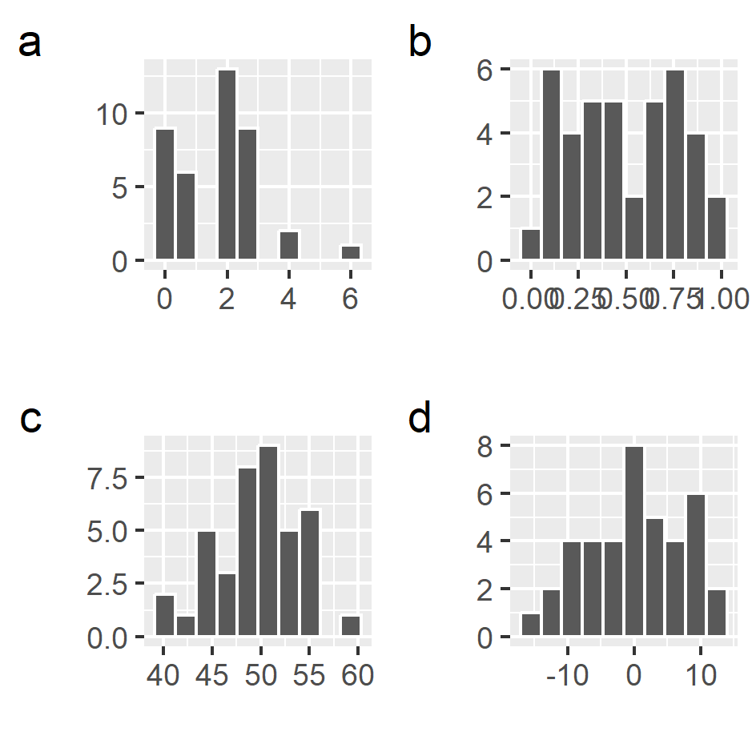

```{r setup, include=FALSE}
library(learnr)
knitr::opts_chunk$set(echo = FALSE,
                      warning = FALSE, 
                      message = FALSE)

# load bio data
forest <- read.csv("./data/bio_index.csv")

```


## Regression with more than one predictor

Regression analysis with multiple predictors (or independent variables) follows the same analysis steps as before. One of the main differences is how you can visualise your analysis, both during the exploratory stage, as well as when presenting your results. With any more than two variables, it's difficult to visualise with a scatterplot.

Another difference is in the output. You will see a coefficient, standard error and p-value for each predictor you include in the model. First, look at the overall result of the model, then at which of the individual predictors is significant.

### Example workflow

-1 *Ask your question*

Our response variable (`bio_index`) is an index of forest biodiversity health (a continuous variable, measured through Earth Observation, with higher values representing better health). We are interested in which of three variables might potentially influence in forest health:   
- `indicator_spp`: indicator species richness (species richness of a suite of 25 forest dependent species)  
- `cover`: ground cover (percentage, measured through 5 x 5 m plots)  
- `distance`: distance to nearest large (> 5 ha) forest patch (in km)    

We will use a regression analysis to evaluate which of the above is a significant predictor of forest health. As always, we may have theories about the causal effects of the predictors, but without specific manipulative experiments, we can't draw firm conclusions on cause and effect.


-2 *Check and explore your data*

As always, check your data have imported correctly by using the `head()` and `str()` functions. Do this below, after running the code to import the data.

```{r import_data, exercise = TRUE}

forest <- read.csv("./data/bio_index.csv")


```

```{r import_data-hint-1}

forest <- read.csv("./data/bio_index.csv")
head(forest)
str(forest)

```

Use the summary function on the whole data.frame to see the range and median values of your data. This is also a useful check on your data. Some data should be within certain values (e.g. percentages should be between 0 and 100).#

```{r summary_check, exercise = TRUE}


```

```{r summary_check-solution}

summary(forest)

```

As we have more than one predictor, we will use a pairs plot to visualise the relationships between all pair-wise combinations of our data. Conveniently, our data.frame only has numeric variables and we are interested in all of them. So we can simply put the data frame into the `pairs()` function. Try that here:

```{r pairs_plot, exercise = TRUE}


```

```{r pairs_plot-solution, exercise.reveal_solution = TRUE}

pairs(forest)

```
We are looking for two different kinds of relationships:   
1. Relationships between the response and the predictors (look at just the first row)   
2. Relationships between the predictor variables (everything not on first row or first column)  

Relationships between the response and predictors will give us a clue about what results may show up in the model. In the case of relationships between predictors, we want to avoid including strongly correlated predictors within the model as this can have adverse effects on the model.

You can always plot individual plots of pairs of variables using the `plot()` function, if you want to have a better look. Either look at the pairs plots, or make some individual plots and answer these questions:

```{r quiz1}
quiz(
  question_checkbox("Which pair of variables does this plot represent ",
                    answer("biodiversity index", correct = TRUE),
                    answer("indicator species", correct = TRUE),
                    answer("ground cover"),
                    answer("distance to large patch"),
                    random_answer_order = TRUE,
                    allow_retry = TRUE),
  question_radio("What sign does the relationship in the above graphic have?",
                 answer("Positive", correct = TRUE),
                 answer("Negative"),
                 message = "Look at the slope of the relationship ...",
                 random_answer_order = TRUE,
                 allow_retry = TRUE),
  question_radio("What sign would you expect a correlation coefficient to have?",
                 answer("Positive", correct = TRUE),
                 answer("Negative"),
                 message = "Same as above!",
                 random_answer_order = TRUE,
                 allow_retry = TRUE)
)
```

Look at the other relationships and think about the above questions!


-3 *Decide on your stats test*  
As we have a numeric response and we think that there might be a linear relationship between our variables and the response, we will use a multiple linear regression.


-4 *Run the test*  
The code for a regression with multiple predictors is very similar to a regression with just one. We add the predictors to our *formula* argument:
`bio_index ~ indicator_spp + cover + distance`. Then, we tell R where to find our data frame with the *data* argument: `data = forest`. Use these to complete the `lm()` function below. As before, we will assign the results of the regression to an object, for convenience.

```{r make_mod, echo = FALSE}
myMod <- lm(bio_index ~ indicator_spp + cover + distance, data = forest)

```


```{r lm_1, exercise = TRUE, exercise.setup = "make_mod"}

myMod <- lm(bio_index )

```

```{r lm_1-solution, exercise.reveal_solution = TRUE}

myMod <- lm(bio_index ~ indicator_spp + cover + distance, data = forest)

```

-5 *Interpret your results*  
As before, we'll use the `summary()` function to look at the results of our model. Put your model object, `myMod` into the function below:

```{r mod_summary, exercise = TRUE, exercise.setup = "make_mod"}

```

```{r mod_summary-hint-1}
summary(myMod)

```

You'll see that you have some extra results for each predictor. Before we look at those, let's check the significance of the overall model and check the assumptions by plotting the residuals. You can access the residuals by using this code: `myMod$residuals`. In case you were wondering, the `myMod` object is actually a list, and you access each element of the list, using the `$` operator and the name of the element `residuals`, just like accessing the `column` in a `data.frame`.

```{r hist_resid, exercise = TRUE, exercise.setup = "make_mod"}

```

```{r hist_resid-hint-1}

## use the histogram function!
hist()

```

```{r hist_resid-solution, exercise.reveal_solution = TRUE}

hist(myMod$residuals)

```

You can also look at the default evaluation plots for the model by just plotting the model object (`myMod`).

```{r plot_mod, exercise = TRUE, exercise.setup = "make_mod"}

plot(myMod)

```

```{r comment1, eval = FALSE, echo = FALSE, include = FALSE}

question("My Question",
		answer(
			htmltools::img(
				src = "https://pkgs.rstudio.com/gradethis/reference/figures/logo.png"
			), 
			correct = TRUE
		)
	)

```


```{r quiz2, fig.width = 2}
quiz(
  question_radio("Which of these plots matches your histogram of the residuals? ",
                    answer("a"),
                    answer("b"),
                    answer("c"),
                    answer("d", correct = TRUE),
                    random_answer_order = FALSE,
                    allow_retry = TRUE),
  question_radio("What is your conclusion from the above histogram?",
                 answer("Residuals are approximately normally distributed", correct = TRUE),
                 answer("Residuals are not normal"),
                 answer("I'm not sure"),
                 try_again = "Does the histogram have an approximate 'bell curve' shape of the normal distribution?",
                 random_answer_order = TRUE,
                 allow_retry = TRUE),
  question_radio("Does the first residual plot show any strong patterns?",
                 answer("No", correct = TRUE),
                 answer("Yes"),
                 try_again = "Does it approximate a starry sky??",
                 random_answer_order = TRUE,
                 allow_retry = TRUE),
  question_checkbox("Look back at the model output. Tick all of the statements below that are true",
                 answer("Overall, the model is significant", correct = TRUE),
                 answer("The p-value for the overall model is less than 0.05", correct = TRUE),
                 answer("The full model showed a significant improvement over the Null model (F = 14.97~3,36~, p < 0.001", 
                        correct = TRUE))
)
```

Now, having checked the model assumptions and looked at the overall fit, we can look at the significance of the individual predictors.

```{r quiz3}
quiz(
  question_checkbox("Which of the predictors (or independent variables) is signficant? ",
                 answer("Ground cover"),
                 answer("Indicator species", correct = TRUE),
                 answer("Distance to large patch", correct = TRUE),
                 random_answer_order = FALSE,
                 try_again = "Which predictors have a p-value of < 0.05?",
                 allow_retry = TRUE)
)

```  
-6 *Present your results*

You could present your results with a table of the model results, showing the coefficient estimates, standard errors and p-values. You could also include a sentence with the overal p-value and the associated F statistic (as above in the quiz). Finally, you could present some partial plots or response plots, that show the response of an individual predictor (predicted values against predictor values) while all the other predictor values in the model are held at their mean value. We will look at this later.

**Note -- extension** 
Although you can tell from these results which predictors are significant, it's difficult to assess which predictor has a larger or smaller effect due to the predictors having different ranges (e.g. *cover* ranges from 0 to 100, *distance* is just 0 to 5). To compare coefficient sizes, you need to **scale** your predictor values before putting them into the model. You can do this with the `scale()` function. This converts your predictor value onto a scale of standard deviations about a mean of 0. The `scale` function subtracts the overall mean of your predictor from each value, and then divides it by the standard deviation. For example,  
- a scaled predictor with a value of 0 would have the mean value of your predictor   
- a value of 1 would mean that your actual predictor value is 1 standard deviation above the mean  

So for the distance variable, the mean value is `r round(mean(forest$distance),2)` km, and the standard deviation is `r  round(sd(forest$distance),2)` km. Therefore, a *scaled value* of 1 would translate to a real value (unscaled) of `r round(mean(forest$distance),2)` + `r round(sd(forest$distance),2)` = `r round(mean(forest$distance) + sd(forest$distance),2)`. A value of 2, would mean 2 standard deviations above the mean, or `r round(mean(forest$distance),2)` + (2 x `r round(sd(forest$distance),2)`) = `r round(mean(forest$distance) + 2*sd(forest$distance),2)`. Negative values are in standard deviations below the mean.


To scale in R, you can use the scale function:

```{r scaling, exercise = TRUE}

scale(forest$distance)

```
Look at the 10th value - it's almost 0. This means our 10th value in the `forest$distance` vector is close to the mean. Note that we can use the square brackets to show just a single value. 

```{r scaling2, exercise - TRUE}

forest$distance[10]
mean(forest$distance)

```

Look at the 12th value of the *scaled* `forest$distance` vector. It's value is almost -1. This means it's one standard deviation below the mean. Use R to calculate this value in the code box below.

```{r scaling3, exercise = TRUE}


```

```{r scaling3-hint-1}

# Use sd() to get the standard deviation... 
sd(forest$distance) 

```

```{r scaling3-hint-2}
# Use mean() to get the mean......


```

```{r scaling3-hint-3}

# Now subtract the sd() from the mean().....


```

```{r scaling3-hint-4}

# Now subtract the sd() from the mean().....
mean(forest$distance) - sd(forest$distance)

```

Now check your answer with the *unscaled* value. Remember, it's the 12th value of the `forest$distance` vector.


```{r scaling4, exercise = TRUE}
forest$distance[12]
mean(forest$distance) - sd(forest$distance)

```


## Your turn! 


#### Extension exercise
Use the forest data (download these from the KLE) and re-run the model from the tutorial, but this time use the scaled data. First, make a new data frame with the three predictor variables scaled (use the `scale` function!) and then follow the same code as above. Now re-run the same model as in the tutorial. Look carefully at the outputs of the two model summaries (with scaled and unscaled predictors). What parts of the summary are similar? What parts are different?


## Regression with a binary response - logistic regression

Regression analyses can also be implemented with binary or count response variables. Here we will begin with binary (e.g. presence or absence data) as the response. With binary (or logistic) regression, instead of predicting the value of our response, we are predicting the probability of an outcome, so in this case, the probability of species presence given known values of our predictors.  

We have a study looking at factors influencing presence of a lizard species: mean annual temperature and percentage cover of vegetation (from 10 m diameter vegetation plots). So with this analysis, we could ask which predictors are significant predictors of lizard presence, or which could ask what is the probability of a lizard occurring in a habitat with certain values of our predictors.

The interpretation of the results is similar to linear regression, although the regression equation is different. In this tutorial we will focus primarily on interpreting the results.


As always, we can start by loading the data and doing some data exploration.

```{r import_binary, exercise = TRUE}

lizard_data <- read.csv("data/lizard_data.csv")

```

Explore the data here, use functions such as `head()`, `summary()`, and `pairs()`. You will see that the response has just two values (0, 1). However, you might still be able to discern some relationships with the predictors. Have a look!

```{r explore1, exercise = TRUE, exercise.setup = "import_binary"}

```

```{r explore1-solution}

## check first values and data types
head(lizard_data)
str(lizard_data)

# Check range of values, presence of NAs
summary(lizard_data)

# Check relationships and correlations between variables
pairs(lizard_data)

```

Are any of the predictors correlated? Do you expect any relationships to show up in the regression analysis?

For regression analysis beyond linear regression, we will use the `glm` function. Here we can add a `family` argument depending on the type of the response. For binary data, we will use `family = binomial`. Otherwise, the function works in the same way as `lm()`.

Run the code to perform the binary regression.

```{r binary_glm, exercise = TRUE, exercise.setup = "import_binary"}

glm1 <- glm(obs ~ temp + cover, family = binomial, data = lizard_data)

```

As before, we can use the `summary()` function with the model object (`glm1`) to look at the results. Complete the code to see the summary. You will see that they are slightly different to the `lm` results.

```{r glm_summary, exercise = TRUE, exercise.setup = "binary_glm"}


```

```{r glm_summary-solution, exercise.reveal_solution = TRUE}

summary(glm1)

```

A useful function with binary data is `table()`. This will count how many observations we have in each category (presence / absence). Use just the column of observation `lizard_data$obs` inside the `table` function. Complete the code!

```{r table_bin, exercise = TRUE, , exercise.setup = "import_binary"}

```

```{r table_bin-solution, exercise.reveal_solution = TRUE}

table(lizard_data$obs)

```


Notice that we don't have the same overall model fit statistics at the end of the output. We can recreate a type of "pseudo R^2^" by comparing the *explained deviance* to the *null deviance*. We can also test whether the model performance is improved with the predictors, or whether it is better without any predictors at all (a null model). This is essentially what is tested by the ANOVA test (F statistic) in the linear model.

The code below gives us a p-value for the test of whether our model is better than the null model.

```{r chi_test, exercise = TRUE, exercise.setup = "binary_glm"}

# get the chi-square statistic
chisq <- glm1$null.deviance - glm1$deviance 

# get the degrees of freedom for the test
chisq_df <- glm1$df.null - glm1$df.residual 

# get the p-value for the test
1 - pchisq(chisq, chisq_df) 

```

As you can see, the p-value is < 0.05, so we can conclude that our model is better than the null model.

The **pseudo R^2^**, as in the linear model, is how much variability in the data is explained by the model. The deviance is a measure of the unexplained variance of the model. It is calculated from the difference between the observed and predicted values. If the model explains more variability than the null model, then you would expect the (residual) deviance to be less than the null deviance (check this on the model output). The explained deviance is the null deviance - the residual deviance. The R^2^ is then calculated as the $explained~deviance / null~deviance$:


```{r r2_glm, exercise = TRUE, exercise.setup = "binary_glm"}

# calculate the pseudo-R2
(glm1$null.deviance - glm1$deviance) / glm1$null.deviance

```


Then, we can look at the significance of each predictor (in a similar way to the linear model). However, the interpretation of the coefficients is different. First, we need to transform the coefficients to an 'odds ratio'. 

```{r odds, exercise = TRUE, exercise.setup = "binary_glm"}

exp(glm1$coefficients)[2:3]

```

When the value of the odds ratio is below 1, the relationship between our response and the predictor is **negative**. When the odds ratio is greater than 1, then the relationship between the response and the predictor is **positive**. 


We can also plot the results, one variable at a time. 


```{r, ggplot_glm, exercise = TRUE, exercise.setup = "import_binary"}

library(ggplot2)

ggplot(lizard_data, aes(x = cover, y = obs))+
  geom_point()+
  geom_smooth(method = "glm", method.args = list(family = "binomial"), formula = y ~ x, se = TRUE)+
  xlab("Ground cover")+
  ylab("Probability of presence")

```

In the plot, you can see that the direction of the relationship is negative (our odds ratio for cover is < 1), so with higher ground cover, there is less probability of lizard presence.


## Your turn! Logistic regression


You have data on presence and absence of a beetle species, with two possible predictors, water content of soil and soil density. Run a logistic regression, as in the tutorial, to find out which, if any, of the predictors has a significant effect on the probability of beetle presence. 

Download the `beetle_data.csv` from the KLE. 

Remember to check over your data first, and finally, to present your results in a report format, with a table and a graphic.


