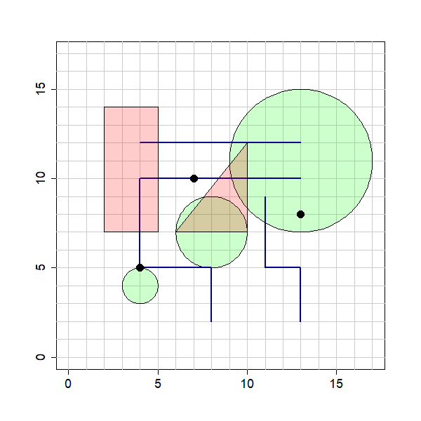

```{r setup, include=FALSE}
## 

library(learnr)
knitr::opts_chunk$set(echo = FALSE,
                      warning = FALSE, 
                      message = FALSE)
library(knitr)

#library(terra)
library(sf)
#library(geodata)

vtrees <- readRDS("data/vtrees.rds")
tree_buffer <- st_buffer(vtrees, dist = 100)
roads <- readRDS("./data/roads.rds")

## points
mp <- data.frame(id = c("pt1","pt2", "pt3"),
                 x = c(4,7,13),
                 y = c(5,10,8))
pts <- st_as_sf(mp, coords = c("x", "y"))

set.seed(2)
mp2 <- data.frame(x = as.integer(runif(15, 2, 14)),
                  y = as.integer(runif(15, 2, 14)))
rnd_pts <- st_as_sf(mp2, coords = c("x", "y"))

## lines
s1 <- st_as_sfc(st_as_text(
  st_linestring(rbind(c(4,12),c(13,12)))))
s2 <- st_as_sfc(st_as_text(
  st_linestring(rbind(c(8,2), c(8,5), c(4,5), c(4,10), c(13,10)))))
s3 <- st_as_sfc(st_as_text(
  st_linestring(rbind(c(13,2), c(13,5), c(11,5), c(11,9)))))
lns <- st_as_sf(data.frame(id = c("line1", "line2", "line3"),
                  geometry = c(s1, s2, s3)))

## circles
centroids <- st_as_sf(
  data.frame(id = c("circle1", "circle2", "circle3"),
             x = c(4,8,13),
             y = c(4,7,11)),
  coords = c("x", "y"))
r <- c(1,2,4)
crcls <- st_buffer(centroids, dist = r)

inner_buffer <- st_buffer(crcls, dist = -0.5)

## polygons
p1 <- st_as_sfc(st_as_text(st_polygon(list(rbind(c(5,7), c(5,14), c(2,14), c(2,7), c(5,7))))))
p2 <- st_as_sfc(st_as_text(st_polygon(list(rbind(c(10,7), c(10,12), c(6,7), c(10,7))))))
pls <- st_as_sf(data.frame(id = c("rectangle", "triangle"),
                           geometry = c(p1, p2)))

rm(mp, mp2, s1, s2, s3, centroids, r,
   p1, p2)

```


## Introduction to the sf package in R

The `sf` package extends R into a powerful GIS for vector data (points, lines, polygons) based on the **s**imple **f**eatures [standards for geographic data](https://en.wikipedia.org/wiki/Simple_Features). The package uses an extended form of the data.frame to include a `geometry` column, holding the spatial data (points, lines, polygons). The other columns of the data.frame can hold attribute table (like the attribute table of a shapefile).  
Most of the functions you'll use begin `st_`, such as, `st_buffer()` to create a buffer around shapes. This is convenient, as it tells you which package the function comes from.

Here is an sf `data.frame` for a point file. These are the locations of ancient trees on Keele campus. It contains four columns of attribute data (id, girth, species, status) and the geometry column with the point coordinates.

```{r sf_dataframe1}
kable(data.frame(vtrees), row.names = FALSE)
```

Note that when we print the sf dataframe, we can also see other spatial attributes, such as the number of rows (features) and columns (fields), the geometry types, the extent (bounding box) and the coordinate reference system (CRS).

```{r sf_dataframe2}
print(vtrees)
```

```{r quiz1}
quiz(
  question_radio("What is the geometry type of the above data frame?",
                 answer("Point", correct = TRUE),
                 answer("Polygon"),
                 answer("Line"),
                 answer("MultiPoint"),
                 answer("MultiPolygon"),
                 random_answer_order = TRUE,
                 allow_retry = TRUE),
  question_radio("What does the value of ymin correspond to?",
                 answer("The lowest value of longitude"),
                 answer("The lowest value of latitude", correct = TRUE),
                 answer("The highest value of latitude"),
                 answer("The highest value of longitude"),
                 random_answer_order = TRUE,
                 allow_retry = TRUE),
  question_radio("What is the most northern latitude of the data set?",
                 answer("-2.275066"),
                 answer("52.99889"),
                 answer("-2.272921"),
                 answer("53.00403", correct = TRUE),
                 random_answer_order = TRUE,
                 allow_retry = TRUE),
  question_radio("What is the coordinate reference system of the data?",
                 answer("wgs 84", correct= TRUE),
                 answer("CRS"),
                 answer("Geodetic"),
                 answer("Lat Lon"),
                 random_answer_order = TRUE,
                 allow_retry = TRUE),
  question_radio("How many points does the data set have?",
                 answer("4"),
                 answer("5"),
                 answer("6", correct = TRUE))
  )

```

#### **Simple plotting**

We can plot the data set, using the `plot` function. By default, it will create a separate plot for each attribute column of the dataframe.


```{r sf_plot1, exercise = TRUE}
plot(vtrees)
```

To limit this to just a single column, we can subset the dataframe using `[,]`. For example, to plot just the species:

```{r sf_plot2, exercise = TRUE}
plot(vtrees[,"species"], pch = 16)
```
   

******
**R code reminder:** You can subset a `data.frame` by using the square brackets [,] directly after the `data.frame` name.   
- Before the comma: select rows with row numbers `c(1,4,6,10)` or a logical expression `vtrees$species == "oak"`;  
- after the comma: select columns with column names `c("species", "id")`, numbers `1:3` or a logical expression.  
******


Plot the points, showing the value of the girth as a colour gradient:

```{r sf_plot3, exercise = TRUE}

```

```{r, sf_plot3-solution, exercise.reveal_solution = TRUE}
plot(vtrees[,"girth"], pch = 16)
```

To limit this to just the points, we can use the `st_geometry()` function. Then, we can also provide extra information for the colour of the points (`col`) and the type of symbol (`pch`), among others.


```{r sf_plot4, exercise = TRUE}
plot(st_geometry(vtrees), pch = 16, col = "darkgreen")
```

We can add other layers to a plot by plotting each in turn. The simplest way of making quick plots is to use st_geometry() and then include `add = TRUE` in subsequent calls to plot to add extra layers.

Here we plot a simple layer of roads on Keele campus, and then add the veteran tree locations.

```{r sf_plot_add, exercise = TRUE}

plot(st_geometry(roads_Keele), col = "black")
plot(st_geometry(vtrees), pch = 16, add = T, col = "darkgreen")

```

If you don't use `st_geometry`, then in the first plot, you need to use `reset = FALSE` to allow a second plot on top. This is useful if you want to include the default title and legend.

However, there are other ways to plot spatial information, especially for cartography (with the `tmap` package. We will look at these later).

#### **Importing spatial data into R**

##### From a shapefile

To import data from a shapefile (or other spatial format, e.g. .kml, .gpx), use the `st_read()` function. For most formats, you can simply use the path to your file. Remember, for shapefiles, these are made up multiple components, they all need to be in the same folder, but you only need to include the .shp component in your `st_read()` function.


Note that we have to name and create an R object on the left-hand side of the `<-` arrow, you can name this as you like, but keep it short and meaningful!

```{r import_sf, exercise = TRUE}

keele_roads <- st_read("data/keele_roads.shp")

```

Print the `keele_roads` object and look at the structure of the data frame, the coordinate system and the extent.

```{r print_sf, exercise = TRUE}

```

```{r print_sf-solution}

keele_roads

```

##### From a data frame in R (with coordinate columns)

You can also convert a data frame in R (that has columns containing coordinates) into a spatial point data frame. You may have data in a text file (e.g. `.csv`) that you will need to import into R first as a normal data frame. Add code to look at the data frame - which columns contain the coordinates?

```{r import_csv, exercise = TRUE}

# Read in data from text file
pts_df <- read.csv("data/point_records.csv")

```

```{r import_csv, exercise = TRUE}

# Read in data from text file
pts_df <- read.csv("data/point_records.csv")

# look at data - which columns contain the coordinates?
head(pts_df)

```

Now you can use the sf function `st_as_sf()` to convert the data frame to a spatial dataframe. The `coords` argument tells sf which columns contain the coordinates. **Make sure you spell the column names exactly as they are in the data frame!** And don't forget the **coordinate reference system**

```{r convert_csv_sf, exercise = TRUE}

# Convert to sf data frame (use coords argument to name the columns with the coordinates)
pts_sf <- st_as_sf(pts_df, 
                    coords = c("lon","lat"),
                    crs = 4326) # don't forget to say what the coordinate reference system is.

```

Now plot the point data you have just imported:

```{r plot_csv_sf, exercise = TRUE}


```


```{r plot_csv_sf-solution, exercise.reveal_solution = TRUE}

plot(pts_sf)

```

#### **Transforming between Coordinate Reference Systems**

The veteran trees shapefile is in WGS 1984 geographic coordinates. It would be more useful to have this as British National Grid, so that it is compatible with the other spatial data we are going to use later. We can use the `st_transform()` function to convert between coordinate reference systems (CRS). 

```{r transform1, exercise = TRUE}

vtrees_bng <- st_transform(vtrees, crs = "EPSG:27700") 

```

Note that we have to place the original sf object first (vtrees), then the new CRS. The format for the coordinate reference system follows the [EPSG standard](). As you can see above, the British National Grid has the [code 27700](). Print the transformed object in the code box above to verify the new CRS.

#### **Geoprocessing operations in sf in R**

For this section, we're going to use some simple shapes made up of points, lines and polygons. As these are only for illustration, they don't have a coordinate reference system, but they are still `sf` objects, and we can visualise their coordinates if we include axes and grid lines on a plot.




##### **Points**

The first set of points is called `pts`. Print the `pts` object and then plot it here, using `pch = 16` to give them a solid fill.

```{r points1, exercise = TRUE}


```

```{r points1-solution, exercise.reveal_solution = TRUE}

pts
plot(pts, pch = 16)

```

We can extract the coordinates from the `sf` object (e.g. for each point in this example) by using the `st_coordinates()` function. Simply put `pts` inside the function and run it.

```{r pts_coords, exercise = TRUE}


```

```{r pts_coords-solution, exercise.reveal_solution = TRUE}

st_coordinates(pts)

```

Now check that these coordinates are the same as on the image above, showing the grid lines and axes.


##### **Buffer**

We can add a buffer around a geometry (point, line or polygon) by using `st_buffer()`. We need to add a buffer distance, usually in metres, unless otherwise specified.

For example, here we add a buffer of 5 (m) to each of the three points in `pts`

```{r buffer_pts, exercise = TRUE}

pts_buffer <- st_buffer(pts, dist = 5)

```

We can plot the buffers and then add the points to check:

```{r buffer_pts_plot, exercise = TRUE, exercise.setup = "buffer_pts"}

plot(st_geometry(pts_buffer)) # we use st_geometry for a simple plot
plot(st_geometry(pts), add = T) # here we use add to add to the previous plot
```

We could also create buffers with different distances around the points by using a vector of different distances, i.e. c(4,3,5).

```{r buffer2_pts, exercise = TRUE}

pts_buffer2 <- st_buffer(pts, dist = c(4,3,5))

```

Now print the object (just run `pts_buffer2`) and then plot the buffers:
```{r buffer_pts2_plot, exercise = TRUE, exercise.setup = "buffer2_pts"}


```

```{r buffer_pts2_plot-solution, exercise.reveal_solution = TRUE}

# note that we have the same id column still in the data frame
pts_buffer2 

# If you plot the sf data frame, then you can colour by id
plot(pts_buffer2)

```

**Try this!**
Create a 100 m buffer around the veteran trees. You might need this for planning infrastructure development on campus. Call the object, `tree_buffer`

```{r buffer1, exercise = TRUE}

```

```{r buffer1-solution, exercise.reveal_solution = TRUE}

tree_buffer <- st_buffer(vtrees, dist = 100)

```


Now plot just the geometry of the buffers, in grey, and then add just the points on top in blue.

```{r buffer2, exercise = TRUE}


```

```{r buffer2-hint-1}

# Use st_geometry() to plot just the polygons or points

```

```{r buffer2-hint-2}

# Use col = "grey" for the colour.

```

```{r buffer2-hint-3}

# Use add = TRUE to add the points to the plotted buffers

```


```{r buffer2-solution, exercise.reveal_solution = TRUE}

plot(st_geometry(tree_buffer), col = "grey")
plot(st_geometry(vtrees), pch = 16, col = "blue", add = T)

```

##### **Lines**

Here we have three lines in an sf data frame. The object is `lns`. Plot the lines! Use `lwd = 2` inside the `plot()` function to increase the width of the lines (only on the plot).

```{r lns_plot1, exercise = TRUE}

```

```{r lns_plot1-solution,exercise.reveal_solution = TRUE}

plot(lns, lwd = 2)

```

We can measure the length of the lines using `st_length`

```{r lns_length, exercise = TRUE}

st_length(lns)

```

This gives us the length in map units (usually metres, e.g. if we are using British National Grid).

Look back at the image with the shapes above and verify the lengths. For example, line 3 goes from (4,12) to (13,12), so its length is from 4 to 13 along the x-axis direction. That's 13-4 =  9 map units.

In the same way as with the points, we can create buffers around lines. Try creating a buffer of 1 (m) around all of the lines. Assign it to an object called `lns_buffer` and then plot it!

```{r lns_buffer, exercise = TRUE}


```


```{r lns_buffer-solution, exercise.reveal_solution = TRUE}

lns_buffer <- st_buffer(lns, 1)
plot(lns_buffer)

```

##### **Polygons**

We have some circles (`crcls`) and other polygons (`pls`) in two other sf data frames. Here, we plot just the geometry of the circles:

```{r plot_pols, exercise = TRUE}
plot(st_geometry(crcls))

```

Now plot the circles again, exactly as above, and add just the geometry of the other polygons. 

```{r plot_pols2, exercise = TRUE}

plot(st_geometry(crcls))


```

```{r plot_pols2-solution, exercise.reveal_solution = TRUE}

plot(st_geometry(crcls))
plot(st_geometry(pls), add = T)

```

A useful function is to find the area of the polygons. `st_area()` will do that, for each polygon in the data frame. The units will be in map units - usually m^2^. So you'll probably need to convert to ha (divide by 10 000) or km^2^ (divide by 1 000 000) in most cases. 

```{r area_pol, exercise = TRUE}

st_area(crcls)

```
We can add buffers in the same way as above. With polygons, we can also add internal buffers by using negative distances. Use the `st_buffer()` function with a distance of `-0.5` to add an internal buffer to just the circles. Assign it to an object and plot it!

```{r neg_buffer, exercise = TRUE}


```

```{r neg_buffer-solution, exercise.reveal_solution = TRUE}

inner_buffer <- st_buffer(crcls, dist = -0.5)
plot(st_geometry(crcls))
plot(st_geometry(inner_buffer), add = TRUE)

```

What's the area of the inner buffers? Use the code box to find out!

```{r inner_area, exercise = TRUE}

```

```{r inner_area-hint-1}

st_area(inner_buffer) 
## NOTE!! Use the name of your object if you didn't call it 'inner_buffer'

```


##### **Convex hull**

It often useful to delimit a study area around points or polygons using a convex hull - this draws a polygon around all the outer limits of the polygons or points. 

```{r chull1, exercise = TRUE}

cHull_pts <- st_convex_hull(pts)

```

What do you notice if we plot this?

```{r plot_chull1, exercise = TRUE, exercise.setup = "chull1"}

plot(st_geometry(cHull_pts))

```

It hasn't worked in the way expected! We need to union the points before creating the convex hull. 

```{r chull2, exercise = TRUE}

cHull_pts <- st_convex_hull(st_union(pts))

```

Now plot the convex hull and then add the points.

```{r chull2_plot, exercise = TRUE}


```


```{r chull2_plot-solution, exercise.reveal_solution = TRUE}

plot(cHull_pts)
plot(st_geometry(pts), add = T, pch = 16)

```

If you were delimiting a study area, you might want to add a buffer around the convex hull so that your points/polygons are not right at the edge of the study area.

##### **Intersection**

Intersections are fundamental geometrical operations. For example, we can use them to calculate area of overlap in geometries. Look at the plot of the circles and other polygons. Note the shapes of the overlaps.

```{r}

plot(st_geometry(crcls), col = rgb(1,0,0,0.3))
plot(st_geometry(pls), add = T, col = rgb(0,0,1,0.3))

```

Here we create a new polygon for just those areas of overlap, using `st_intersection`. The result is a new set of polygons for those overlapping areas with attributes from both data frames. You can see the id values from each (note that as the column names are the same, the second has .1 appended to it).

```{r intct1, exercise = TRUE}

intsct <- st_intersection(crcls, pls)
intsct
plot(st_geometry(intsct), col = "grey")

```

Here we plot both initial shapes again, and then just the intersection in colour:

```{r intct2, exercise = TRUE, exercise.setup = "intct1"}

plot(st_geometry(crcls))
plot(st_geometry(pls), add = T)
plot(st_geometry(intsct), col = "grey", add = T)

```

What is total area of the overlapping segments?

```{r intct_area, exercise = TRUE}


```


```{r intct_area-solution, exercise.reveal_solution = TRUE}

st_area(intsct)

```

##### **Points in polygon**

We can also use `st_intersection()` to extract points that are within a polygon. The example will extract from a set of random points those that lie in the largest circle of the `crcls` polygon. First we will select just circle3. Note how we use the `[,]`, with a comma, to select this shape. This codes says *return the row(s) where `id` is equal to "circle3"*.

```{r clip1, exercise = TRUE}

circle3 <- crcls[crcls$id == "circle3",]

```

Now have a look at these random points, with circle3 plotted on top:

```{r clip2}
circle3 <- crcls[crcls$id == "circle3",]

plot(st_geometry(rnd_pts), pch = 16, ylim = c(0,15),xlim = c(0,15))
plot(st_geometry(circle3), add= TRUE)
```

We can use the `st_intersection()` to extract the point inside the circle.

```{r clip_extract, exercise = TRUE}

pts_extract <- st_intersection(rnd_pts, circle3)

```

Now plot the rnd_pts, then the pts_extract in another colour as well as the circle3 on top. 

```{r clip_extract2, exercise =  TRUE, exercise.setup = "clip_extract"}


```

```{r clip_extract2-solution, exercise.reveal_solution = TRUE}
plot(st_geometry(rnd_pts))
plot(st_geometry(pts_extract), col = "red", pch = 16, add = T)
plot(st_geometry(circle3), add = T)

```

If we just wanted to just identify which points (out of all of them) are inside the circle, then we could use a different kind of function. `st_intersect()`. As oppose to the functions above, this doesn't return a geometry, but tells us which points are inside the circle, and which aren't. More on that later!

##### **Erase**

To erase a part of a polygon with another polygon, we can use the `st_difference()` function.

For example, let's erase the overlaps (that we saw above with the intersection) from the circle shapes.

Here are the geometries again:
```{r erase1}

plot(st_geometry(crcls))
plot(st_geometry(pls), add = T)

```

The 1^st^ argument of `st_difference()` is the shape we want to erase from, and the 2^nd^ argument is the polygon we want to use as the 'eraser'. Note that we need to wrap it with `st_union()`. 

```{r erase2, exercise = TRUE}
circle_erase <- st_difference(crcls, st_union(pls))

```


```{r erase_plot, exercise = TRUE, exercise.setup = "erase2"}

plot(st_geometry(circle_erase), col = "grey")

```


```{r quiz2, include = FALSE}
#### Recap Quiz

quiz(
  question_radio("What is the geometry type of the above data frame?",
                 answer("Point", correct = TRUE),
                 answer("Polygon"),
                 answer("Line"),
                 answer("MultiPoint"),
                 answer("MultiPolygon"),
                 random_answer_order = TRUE,
                 allow_retry = TRUE)
)

```


## Using GIS for sample design
#### **Creating a sampling design for soil survey on Keele campus**

##### Part 1

Using the above geoprocessing skills, you're going to create a sampling design to measure soil properties under veteran trees and under non-veteran trees across Keele campus. You want to sample for soil under veteran trees at not more than 5 m from the tree, but not under the tree itself! For samples at non-veteran trees, we can assume that anywhere in a woodland area will be close to a tree, but you want to avoid any area within 10 m of a veteran tree. You also don't want to sample within 5 m of any road or path (why not?).  

Use each of the following steps to complete the sampling design. 
Create a new project in R studio (use a new instance of R studio if you want to keep this tutorial running) and follow the usual project folder structure. Unzip the "sample_design" folder into your inData folder. Now copy the following instructions into a new R script and make them all into comments (ctrl + shift + C is a shortcut for this in RStudio). Now write the appropriate code between the comments to complete the task. When you have finished, you will have a well-commented script that you might be able to adapt for future fieldwork. Feel free to add further comments that will remind your future self what you were doing!

**Import data**   
1. Install and/or load the appropriate libraries  

2. Import the veteran tree points **vet_trees.shp**, CEH landcover polygons **ceh_lc23_ds.shp** and road lines **OS_vml_road_centreline.shp** shapefiles into R as individual sf objects.  

3. Check the sf dataframes, and make sure all have same coordinate system.   

4. If any are not in British National Grid, transform them to BNG (you can use EPSG:27700).  

**Creating the veteran tree sampling area**   
5. Create a buffer around the veteran trees, and assign to a new object.    

**Creating the non-veteran tree sampling area**   
6. Select just the woodland polygons from the CEH landcover data set and assign them to a new object.  
7. Create a buffer around the paths of the appropriate distance.  

8. Erase the buffered paths/roads from the woodland polygon and assign to a new object.  

9. Create an exclusion buffer around the veteran trees.   

10. Erase the exclusion buffer from the object you saved in (8) and assign to a new object.  

11. Sample 2 points each from the buffer around your veteran trees, and assign to a new object.  

12. Sample 12 points in total from the woodland area (minus the buffered roads and veteran trees) that you saved in (10). 

13. Bind (use `rbind()`) the random points from (11) and (12) into a new object, create a column and label with the type of point (veteran tree sample / non veteran sample) and then save to a shapefile and/or R object on disk.


##### Extension question

A. Can you modify your script so that you don't sample within 5 m of a woodland edge?  

##### Part 2

Can you write a new script to sample soil from points along a distance gradient from veteran trees? Sample 4 points at approximately 0, 2.5, 5, 7.5 and 10 m from the trees. Think in terms of sampling points in concentric polygon rings around the tree. How can you create these from buffers and using the `st_difference()` function? What alternative methods might exist?


## Resources for GIS in R

#### Some resources for using R as a GIS:

[Geocomputation with R](https://r.geocompx.org/)

[Elegant and informative maps with tmap](https://tmap.geocompx.org/)


#### Credits  
Ancient tree inventory data   
https://ati.woodlandtrust.org.uk/

VectorMap Local  
Crown copyright and database rights 2025 Ordnance Survey (AC0000851941)

Land cover map  
Marston, C.; Rowland, C.S.; O’Neil, A.W.; Morton, R.D. (2024). Land Cover Map 2023.
NERC EDS Environmental Information Data Centre. https://doi.org/10.5285/398dd41e-3c08-47f5-811f-da990007643f
