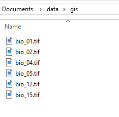

```{r setup, include=FALSE}
library(learnr)
knitr::opts_chunk$set(echo = FALSE)

library(terra)
library(sf)

sp_locations <- read.csv("data/spp_data.csv")

fp <- c("data/gis/bio_01.tif",
        "data/gis/bio_02.tif",
        "data/gis/bio_04.tif",
        "data/gis/bio_05.tif",
        "data/gis/bio_12.tif",
        "data/gis/bio_15.tif")
bio_stack <- terra::rast(fp)

```


## Raster data in R

### Importing rasters

Normally you will have a raster in an external file (e.g. tif) and will want to import it into R. It is also possible to create rasters in R, and then populate with values. 

The R package to import, create, manipulate and analyse rasters is `terra`. Remember to use the correct citation for R packages every time you use them in a report or paper. This function will help:

```{r citation1, exercise = TRUE}

citation(package = "terra")

```

The function to import or create rasters is `rast`. Note that when you start to use multiple packages in scripts, it can help to keep track of where functions are coming from by using the package name followed by two colons before the function name, e.g. `terra::rast()`. However, it's optional.

If you follow a project structure, with a working directory, and folders within this for your inData, and outData, then you can place your raster files (e.g. tif files) in the inData folder (or a gis subdivision of this) and access them from your project. For example, if we have these rasters in our gis folder inside the data (or inData) folder like this:




Then we can import one of these by providing the path to the external file.

```{r import_raster, exercise = TRUE}

bio1 <- rast("data/gis/bio_01.tif")

```

Print the `bio1` object and look at the information about the raster. Answer these questions.


```{r quiz}
quiz(
  question_checkbox("What is the coordinate reference system of the bio1 raster?",
    answer("NA"),
    answer("27700"),
    answer("WGS 1984", correct = TRUE),
    answer("British National Grid"),
    answer("EPSG:4326", correct = TRUE),
    answer("longitude and latitude", correct = TRUE),
    allow_retry = TRUE,
    random_answer_order = TRUE
  ),
  
  question_radio("Where is the raster stored?",
           answer("In R (memory)"),
           answer("On disk - it has the same name as the file we used for import", 
                  correct = TRUE),
           answer("In a temporary file"),
           allow_retry = TRUE,
    random_answer_order = TRUE),
  
  question_radio("What is the extent of the raster?",
                 answer("0.008333333"),
                 answer("-81 to -76 longitude, -10 to -3 latitude", correct = TRUE),
                 answer("WGS 84"),
                 answer("-6.400 to 27.125"),
                 allow_retry = TRUE,
                 random_answer_order = TRUE),
  
  question_checkbox("What is the resolution of the raster bio1?",
                 answer("30 m"),
                 answer("approx. 1 km", correct = TRUE),
                 answer("100 m"),
                 answer("30 seconds", correct = TRUE),
                 answer("0.0083333 degrees", correct = TRUE),
                 allow_retry = TRUE,
                 random_answer_order = TRUE),
  
  question_radio("How many cells are there in the raster bio1? (Use R as a calculator to help you!)",
    answer("490176", correct = TRUE),
    answer("888"),
    answer("552"),
    answer("1440"),
    allow_retry = TRUE,
    random_answer_order = TRUE
  ),
  
  question_radio("What units is the raster projection in?",
                 answer("Degrees", correct = TRUE),
                 answer("metres"),
                 allow_retry = TRUE)
  
)
```

Plot the raster! What function is likely to be used :)

```{r plot_rast1, exercise = TRUE, exercise.setup = "import_raster"}

```

One of the most important features of working with rasters in R is the ability to stack multiple rasters together and perform operations on all of them. However, to be able to do this, **all** the rasters that you stack must have the **same resolution, extent and coordinate reference system**. 

You can either bring rasters in to R individually, and then stack them (especially if you need to change the resolution or extent first), or you can provide a vector of filepaths (i.e. with the `c()` function) to different tifs and create a multi-layered raster stack using the same `rast` function.

Look at the above image of your data organisation, and complete the filepaths for the six rasters. 

```{r import_stack0, exercise = TRUE}

fp <- c("data/gis/bio_01.tif",
        "data/gis/bio_02.tif",
        "",
        "",
        "",
        "")

# Bring in multiple rasters at the same time:

bio_stack <- rast(fp)

```

```{r import_stack0-solution, exercise.reveal_solution = TRUE}

fp <- c("data/gis/bio_01.tif",
        "data/gis/bio_02.tif",
        "data/gis/bio_04.tif",
        "data/gis/bio_05.tif",
        "data/gis/bio_12.tif",
        "data/gis/bio_15.tif")

# Bring in multiple rasters at the same time:

bio_stack <- rast(fp)

```

Now print the bio_stack object. How is it different to the first raster object you created?

Do you remember what these bioclimatic variables represent? 

- bio1 - mean annual temperature  
- bio2 - Mean Diurnal Range (Mean of monthly (max temp - min temp))  
- bio4 - Temperature Seasonality (standard deviation)  
- bio5 - Maximum Temperature of Warmest Month  
- bio12 - Annual Precipitation  
- bio15 - Precipitation Seasonality (Coefficient of Variation)  

Now plot it!

```{r plot_rast2, exercise = TRUE}


```

```{r plot_rast2-solution, exercise.reveal_solution = TRUE}

plot(bio_stack)

```


Once we have rasters in R, we can manipulate them (e.g. change the resolution, extent), extract values from them (e.g. at points, or within polygons), summarise their values (e.g. overall mean, mean by pixel across layers), reclassify raster values (e.g. simplify categories, or convert continuous to binary rasters), and many other spatial operations.

#### Global summaries

We can summarise raster values over the whole raster for each layer. For example, we might want to know the mean value of each bioclimatic variable in our study area. Note, that we need to use `na.rm = TRUE` to disregard NA values in the calculation. 

```{r global_summary, exercise = TRUE}

global(bio_stack, "mean", na.rm = TRUE)

```

What's the range (minimum - maximum) of the values in each raster layer?  Try it here!

```{r global2, exercise = TRUE}

```

```{r global2-solution, exercise.reveal_solution = TRUE}

global(bio_stack, "range", na.rm = TRUE)

```


Note that in `terra::global()`, we use the function name in quotes("") for some special cases: "max", "min", "mean", "sum", "range", "sd". Other functions can also be used. See `?global` for more details. 

#### Extract values at points

Suppose we have our Cinereous finch presences and absences as coordinates in a data frame (`sp_locations`), then we could extract values from these rasters at each point location.

Have a look at the `sp_locations` data frame first (it's already loaded). Note that the third column tells us about presence or absence.

```{r look_sp, exercise = TRUE}

```


Here we use `extract` to extract values from each of the rasters at the same time. Note how we subset the `sp_locations` data frame to just the longitude and latitude columns. Run this code and then use `head()` to have a look at the result.

```{r extract_pts, exercise = TRUE}

sp_data <- extract(bio_stack, sp_locations[,c("x", "y")])

```

What columns are present in the result?

It would be useful to add on the original columns from the `sp_locations` data frame so that we can use these in further analysis. 

As we know that the `sp_data` are in the same order as `sp_locations` we can join the two data sets together with `cbind` (c for column bind). However, it is **much** safer, and **better practice** to use lookup functions (e.g. `dplyr::left_join`) for this.

```{r add_cols, exercise = TRUE, exercise.setup = "extract_pts"}

sp_data <- cbind(sp_data, sp_locations)

```

One advantage of using R for spatial analysis, is that we can then go seamlessly into other types of analysis!! Let's draw boxplots for different bioclimatic variables by presence or absence. Are there any patterns? Try with annual mean temperature or precipitation. Remember the boxplot() function? `variable ~ group` and `data = `?

```{r boxplot1, exercise = TRUE, exercise.setup = "add_cols"}


```

```{r boxplot1-solution, exercise.reveal_solution = TRUE}

# For example:
boxplot(bio_01 ~ pa, data = sp_data)
boxplot(bio_12 ~ pa, data = sp_data)

```

What about correlations between variables. Draw a `pairs` plot for just the bioclimatic variables. You'll need to subset the sp_data within the function to include just the bioclimatic variables (you can use column numbers to subset, i.e. `[,2:7]`)

```{r pairs_plot1, exercise = TRUE, exercise.setup = "add_cols"}

```

```{r pairs_plot1-solution, exercise.reveal_solution = TRUE}

pairs(sp_data[,2:7])

```

Which variables are most correlated?

#### Extract values at polygons

It's useful to be able to extract or summarise values over polygons (as well as points). For that, you can use the `zonal()` function, or the same `extract()` function as above. If you use `extract`, we can use a polygon data.frame instead of a point data.frame

For example, we might want to know the mean temperature and precipitation for some protected areas in the range of the Cinereous Finch. 

First we need to bring in the protected area shapefile:

```{r PA_import, exercise = TRUE}

PE_PAs <- st_read("data/gis/PAs_N_PE.shp")

```

We use the `extract()` function in the same way as above, first the raster, and then the polygons. Note that we add a `fun` argument in a similar way to the `global()` function. Again, the extract function only works with functions like "max", "min", "sum" and "table". Note that we extract the values of all the rasters in our `bio_stack`.

```{r zonal1, exercise = TRUE, exercise.setup = "PA_import"}

pa_mean <- extract(bio_stack, PE_PAs, fun = "mean")

```

We can add the name of the protected area in the same way as above. Use `st_drop_geometry()` removes the geometry column before we bind the "NAME" column to our results `PE_PAs[,"NAME"]`. Which protected area has the highest mean temperature?

```{r addName, exercise = TRUE, exercise.setup = "zonal1"}

pa_mean <- cbind(pa_mean, st_drop_geometry(PE_PAs[, "NAME"]))


```

#### Reclassify values

Another useful operation is to reclassify raster values into a new raster. For example, you might want to simplify the habitat categories in a land use classification or create a binary raster from a continuous raster. The terra package function to do this is `classify`. Let's say we want to create a binary raster from the temperature layer, with mean temperatures of 20 degrees and over classified as 0, and temperatures below 20 as 1.


The classify function uses a table (or matrix) to reclassify the values. This can have three columns, 

- from   
- to  
- new value  

representing the range of values to reclassify (from, to) and then the new value that this range takes on. For example, create the matrix below and print it.


```{r classify1, exercise = TRUE}

rcl = rbind(c(-Inf, 20, 0),
            c(20, Inf, 1))

```

This means, that any value from minus infinity to 20, will take on the value 0 (third column), and any value from 20 to infinity, will take on the value 1. What about the value 20 itself? This is controled by the argument `right`: 

*If right = FALSE, the intervals are open at the right and closed at the left. "open" means that the extreme value is NOT included in the interval.* This is what we want - as we want values of 20 and over (`>= 20`) to be given the new value of 1.

We can use this reclassification matrix, `rcl` in the function. Note how we also only include bio_01 from our raster stack.

```{r classify2, exercise = TRUE, exercise.setup = "classify1"}

bio1_bin <- classify(bio_stack$bio_01, rcl = rcl, right = FALSE)

```

               
Now plot both bio_01 and bio1_bin. You can combine these two with c(), and then plot both at once.

```{r plot_bio1_bin, exercise = TRUE, exercise.setup = "classify2"}


```

```{r plot_bio1_bin-solution, exercise.reveal_solution = TRUE}

plot(c(bio_stack$bio_01, bio1_bin))

```


#### Topography rasters

For working with topography data, you can use `terrain` to make slope, aspect and other ruggednes indices from elevation data. e.g. with a digital elevation raster called `dem`, this would creaete a new raster with the slope, in degrees: `terrain(dem, "slope")`.


## Exercise - Your turn!

Bring in a digial elevation raster for the UK. The file path is `"data/gis/uk_terrain1k.tif"`

```{r UK_DEM, exercise = TRUE}


```

```{r UK_DEM-solution, exercise.reveval_solution = TRUE}

uk_dem <- rast("data/gis/uk_terrain1k.tif")

```

Bring in points for Common and Mountain Hare records and convert to sf data frame.
The filepath is `"/data/NBN_hare_records.csv"`.  
Remember? First use `read.csv()` to bring in the data frame from the .csv file. Then load the `sf` library, and use `st_as_sf()` to convert to an sf data.frame. You'll need to use the `coords` argument to tell sf which columns the coordinates are in. Careful with the spelling of the columns!!! And don't forget the **coordinate reference system**. Have a look at the coordinates and column names..


```{r hare, exercise = TRUE}

```

```{r hare-solution, exercise.reveval_solution = TRUE}

# Read in data
hare_df <- read.csv("data/NBN_hare_records.csv")

# look at data
head(hare_df)

# Convert to sf data frame (careful with column names of coordinates...)
hare_sf <- st_as_sf(hare_df, 
                    coords = c("Longitude..WGS84.","Latitude..WGS84."),
                    crs = 4326)

plot(st_geometry(hare_sf))

```

Can you plot the points on top of the raster? You can use `add=TRUE` in the second plot call.

Now continue in a project in R studio, copy the above code in, make comments, and then complete the code to find the mean elevation (and standard deviation) for both species of hare.  

Create a map and a graphic to show your results!


## Credits

Data used for educational purposes:

**Protected areas**
UNEP-WCMC and IUCN (2025), Protected Planet: The World Database on Protected Areas (WDPA)/ Database on other effective area-based conservation measures. March 2025. Cambridge, UK: UNEP-WCMC and IUCN. Available at: www.protectedplanet.net.

**Hare records**
NBN. Records provided by Mammal Society, accessed through NBN Atlas website. https://registry.nbnatlas.org/public/show/dp8

**DEM UK**
OS Open Data Hub. OS Terrain 50. https://osdatahub.os.uk/downloads/open
[Open Government License](http://www.nationalarchives.gov.uk/doc/open-government-licence/version/3/) 
