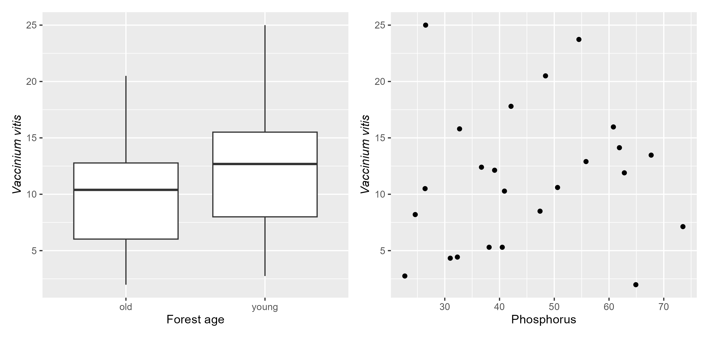
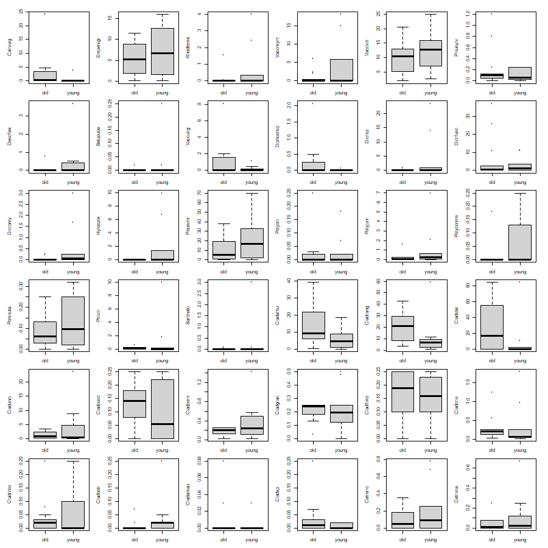
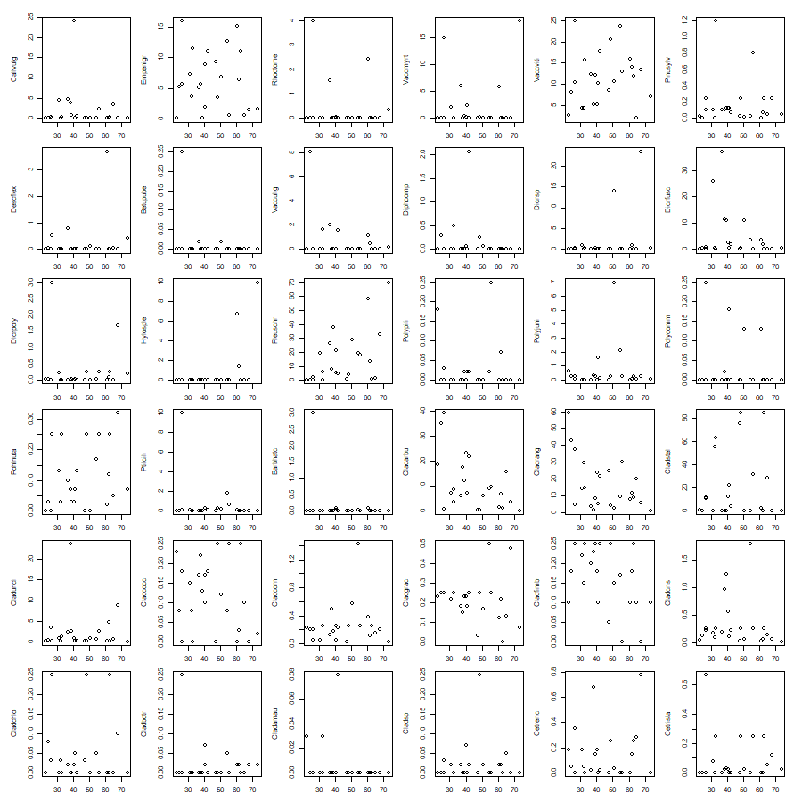

```{r setup, include=FALSE}
library(learnr)
knitr::opts_chunk$set(echo = FALSE)

library(vegan)
data(dune); data(dune.env)
data(sipoo)
data(varechem); data(varespec)
data(mite); data(mite.env)

data(BCI); data(BCI.env)
BCI_trees <- BCI[1:25, 1:40]
BCI_env <- BCI.env[1:25,]
dune.pa <- data.frame((dune[1:15, 1:10]>1)*1)
row.names(dune.pa) <- sprintf("site%02d", 1:nrow(dune.pa))
dune.env <- dune.env[1:15, ]

varespec_pa <- (varespec >0)*1

mite.env <- mite.env[,c("SubsDens", "WatrCont", "Shrub", "Topo")]

```


## 1. About multivariate data

### What is multivariate data?

In ecology, multivariate data often means we have data for many different species, either presence/absence or some kind of count, at many different sites, as well as environmental data for each site (e.g. measured variables such as elevation, habitat type, chemical properties, of a site).

### Data format

#### Species by sample/site matrix
Normally, species are in the columns, along the top, and samples or sites are down the left hand side in the rows. However, it can also be the other way around.

Here, we have presence (1) or absence (0) of 10 plant species from a dune meadow. There are observations of 10 different species at 15 sites. Run the code to see the first six lines of the data set:

```{r duneData, exercise = TRUE}
head(dune.pa)
```

Often, we have environmental data or variables, either measured at each site, or obtained from other sources, e.g. remote sensing. These are also organised in a similar matrix, but with the environmental variables in the columns, and the sites, again, in the rows. There should always be the same number of sites as for your species data.

Run this code to see the first six lines of the data set:

```{r envData, exercise = TRUE}

head(dune.env)

```

#### What are the issues with multivariate data?

Let's say we are interested in the effect of the environmental conditions on the presence or absence of species. If we have a small number of species of interest, we could look at **scatterplots** or **boxplots**, comparing the environmental variable with each species' occurrence. 

For example, we have data on the presence/absence of species of plants from the understorey vegetation of dry *Pinus sylvestris* forests in Finland as well as data on the soil characteristics, including some soil chemistry. Here we look at the effect of stand age and Phosphorus in the soil on *Vaccinium vitis*, using a scatterplot and boxplot, respectively:

{width=60%}

However, in our data set, if we had 36 species, that would mean 36 plots for each environmental variable. This would be difficult to evaluate, and also causes statistical problems, if we wanted to test the significance of each relationship as well. Here we just have two environmental variables...

{width=45%} {width=45%}

So we need another strategy to analyse this data ... multivariate analysis methods!!


## 2. First steps with multivariate data

### Summary information about the data

#### Species richness
But before we start any more complex analysis, always attempt to plot or review your data.

We can start by looking at species richness. Either overall species richness, or species richness at each site.
As we have presence absence data, we can simply sum the presence absence values across the rows, giving a total number of species present at each site.

Note that we are displaying only the species richness for each site as a single row.

```{r spRich1, exercise = TRUE}

rowSums(dune.pa)

## Or using the vegan function
vegan::specnumber(dune.pa)

```

If we had count data for each site, then we could convert to presence/absence prior to summing. Note that we can perform an operation (e.g. > on the whole matrix at once - if this is numeric data). Here, for example, we have data on tree counts at Barro Colorado Island in Panama (`BCI_trees`) at 1-hectare plots. There are 25 plots (rows), numbered 1 to 25, and 40 tree species.

*Your turn* Write the code to view the first 6 lines of the data set called `BCI_trees`:

```{r spRich_count, exercise = TRUE}


```

```{r spRich_count-solution}

head(BCI_trees)

```


We can convert this to presence/absence as follows. Note we are creating a new variable called `BCI_tree_pa` on the left hand side of the assign symbol `<-`.

```{r bci_pa, exercise = TRUE, exercise.eval = TRUE}

BCI_trees_pa <- (BCI_trees>0)*1

```

*Your turn*
Use the same code as above to look at the first 6 lines of this presence/absence data set:

```{r bci_pa_hd, exercise = TRUE, exercise.setup = "bci_pa"}

```

Calculate the species richness by site for the `bci_trees_pa` data set and then answer the questions below.

```{r spRich2, exercise = TRUE, exercise.setup = "bci_pa"}


```


```{r spRich2-solution}
rowSums(BCI_trees_pa)
```

```{r sipoo_Q1, echo = FALSE}

quiz(caption = "Quiz 1",
  question_numeric("How many species of trees are there in plot 14?",
                   answer(16, correct = TRUE)),
  question_radio("How would you calculate the mean number of species across the 25 plots? Which code is correct?",
                 answer("rowSums(BCI_trees_pa)"),
                 answer("mean(rowSums(BCI_trees_pa))", correct = TRUE),
                 answer("mean(BCI_trees_pa)"),
                 answer("mean(BCI_trees)"),
                 random_answer_order = TRUE,
                 allow_retry = TRUE),
  question_numeric("Now calculate the mean number of species across the 25 plots?\nHint: use the correct function in the code box above.",
                   answer(15.48, correct = TRUE),
                   tolerance = 0.5)
)

```


### Prevalence
Another useful metric to review prior to starting any further analysis is the prevalence of species across sites. In other words, at how many sites are species present? Are they common (present at almost all sites) or rare (present at very few sites). For some types of analysis we might want to remove any species that are only present at one or two sites (or none), or at least, evaluate the effects of including rare species in the results of the analysis. That requires us to perform the analysis with and without the rare species.

Again, due to the format of our data, we can simply sum down the columns this time to obtain a value for how many sites each species is present at. Here we show this with the plant species on the sand dunes again.

```{r spPrev, exercise = TRUE}

colSums(dune.pa)

```

Are there any species with few records? Or any species not present at any site?

*Your turn: Calculate species richness per site and prevalence per species on this data set.*

The data, `varespec_pa` are presence/absence values for 44 species of plants from the understorey vegetation of dry *Pinus sylvestris* forests. Complete the following code to show richness and prevalence.

```{r spRich_ex, exercise = TRUE, exercise.eval = TRUE}

head(varespec_pa)

```

```{r spRich_ex-solution}

head(varespec_pa)

rowSums(varespec_pa)
colSums(varespec_pa)

```


## 3. Ordination methods 
### Non-metric Multidimensional scaling (NMDS)

Ordination is a technique often used to visualise multivariate data. We can look for groupings (sites that are similar to each other) and also overlay other variables, e.g. environmental variables in an attempt to look at what may be behind differences between groups of sites.

Here we are looking at a data set of 35 species of Oribatid mites collected over 70 sampling sites in an area 2.5 m x 10 m in size. There are also five environmental variables with data for each site, either numeric (substrate density, water content) or categorical (three classes of shrub density, microtopography type - blanket or hummock).

The data is included in the `vegan` package and you can read about it on the help page in R `?mite`

#### Create the ordination

We use the `metaMDS()` function from the `vegan` package for the NMDS ordination. Look at how the function is used below. We put our data set (as a matrix of species occurrences) first, then some settings. The most important are how many axes we want (`k`) and what distance metric we want to use (`distance`).

```{r nmds1, exercise = TRUE}

# NMDS ordination - 2 axes (k = 2)
nmds <- vegan::metaMDS(mite, distance = "bray", k = 2, try = 100, trymax = 500, trace = 0)

nmds

```

The key information from the nmds result is that a solution was reached (multiple times) and the stress value is < 0.3. Stress values indicate how well the data fit to the number of dimensions. As a general rule of thumb (Clarke, 1993), stress values can be evaluated as:  
  - < 0.05 indicates an excellent fit  
  - < 0.10 good  
  - < 0.20 ok  
  - > 0.20 use with care  
  - > 0.35 poor   

#### Plotting your results  
Ordination is primarily a technique for visualising data by reducing its dimensions. Here we have gone from 35 columns (species) to 2 ordination axes - this allows us to plot all the species on a single plot - and may show us some patterns in their community composition.  

A simple plot of the ordination (remember we only asked for two axes)

```{r nmds2, exercise = TRUE, exercise.setup = "nmds1"}
plot(nmds, display = "sites")

```

Sites that are closer together are more similar to each other in terms of species composition.

#### Adding environmental variables

It can help to interpret the data if we colour the points, add ellipses or add centroids according to groupings contained in the data. For example, the mite data has groups for shrub type and topography. We can use these to colour the points.

Here we will colour the points by the different levels in the microtopography. These are "Blanket" or "Hummock". You can check this with the `levels` function - if the variable is a `factor`.

```{r miteGroups1, exercise = TRUE}

levels(mite.env$Topo)

```

Now we can use this factor with the `col` argument in the `points` function to colour our sites by microtopography type. 
When we plot ordinations in the `vegan` package, we can build up the plot in 'layers' using the `ordiplot` function to plot the axes, then `points` or `text`, and then add either ellipses or other environmental variables. We need to assign the `ordiplot` output to an object (called `plt` here), so that we can use it as the first argument in the subsequent functions to build up the plot. 

```{r miteGroups2, exercise = TRUE, exercise.setup = "nmds1"}

plt <- ordiplot(nmds, type = "n")
points(plt, "sites", pch = 16, col = mite.env$Topo)

```

Black points are at "Blanket" sites, whereas red points are at "Hummock" sites.

Remember that the ordination we performed above only used the information from the counts of each species at the 70 sites. Is there a pattern in the species communities found at "Blanket" or "Hummock" habitats?


Another way of using groups is to draw ellipses, polygons or hulls around points belonging to the same group. Here we will use the three levels of shrub density (None, Few, Many) to draw ellipses around the points belonging to these categories. We can also colour the points by shrub density. 

```{r miteGroups3, exercise = TRUE, exercise.setup = "nmds1"}

# we start the plot with the same two lines as above, but without colours on the points:
plt <- ordiplot(nmds, type = "n")
points(plt, "sites", pch = 16, col = mite.env$Shrub)

## Now we can add ellipses around the points belonging to each shrub grouping:
ordiellipse(plt, groups = mite.env$Shrub, col = 1:nlevels(mite.env$Shrub), lwd = 2)

```

Let's add a legend to the plot to help interpret the colours.

```{r miteGroups4, exercise = TRUE, exercise.setup = "nmds1"}

# we start the plot with the same two lines as above, but without colours on the points:
plt <- ordiplot(nmds, type = "n")
points(plt, "sites", pch = 16, col = mite.env$Shrub)

## Now we can add ellipses around the points belonging to each shrub grouping:
ordiellipse(plt, groups = mite.env$Shrub, col = 1:nlevels(mite.env$Shrub), lwd = 2)

legend("bottomleft", legend = levels(mite.env$Shrub), pch = 21, col = 1:3, bty = "n")

```

```{r quiz1}

quiz(question_checkbox("Which shrub categories seem to have the most dissimilar communities of mites?",
                       answer("None, Few"),
                       answer("None, Many", correct = TRUE),
                       answer("Few, Many"),
                       answer("None"),
                       answer("Many"),
                       try_again = "Remember - the more dissimilar, the further apart the sites will be",
                       allow_retry = TRUE,
                       random_answer_order = TRUE
                       )
     )

```


We can also relate environmental variables to the ordination, and start to look for patterns that might explain some of the similarity. e.g. we might be able to identify environmental gradients along ordination axes. 

Here we use the envfit function to assess how just the numeric environmental variables fit to the ordination.


```{r envFit1, exercise = TRUE, exercise.setup = "nmds1"}

fit <- envfit(nmds, mite.env[, c("SubsDens", "WatrCont")])

```

This analysis allows us to plot arrows for numeric environmental vectors and centroids for factors. 


```{r envFit2, exercise = TRUE, exercise.setup = "envFit1"}

plt <- ordiplot(nmds, type = "none")
points(plt, "sites", pch = 16, col= mite.env$Topo)
plot(fit, p.max = 0.05)

# add legend
legend("bottomleft", legend = levels(mite.env$Topo), pch = 16, col = 1:2, bty = "n")

```

The direction of the arrow points in the direction of increasing values of the variable. The length is proportional to the strength of the relationship. In this example, it seems that "Blanket" sites (black points) have greater water content than "Hummock" sites and that the NMDS2 axes could be interpreted as decreasing substrate density. If multiple arrows from environmental variables point in the same direction (and overlap), then those variables are correlated (or potentially redundant). 


Sometimes, we can also use the arrows from environmental variables to interpret the axes of the ordination. For example, it looks like substrate density (SubsDens) is related to the second, or vertical, nmds axis (NMDS2).


```{r quiz2}

quiz(
  question_radio("As values increase on the NMDS2 axis, would you expect higher or lower values of substrate density (look at the arrow on the plot above)?",
                       answer("Higher"),
                       answer("Lower", correct = TRUE),
                       try_again = "The 'Subsdens' arrow points downwards - look at the scale on the NMDS2 axis - does this increase or decrease in the downwards direction?",
                       allow_retry = TRUE,
                       random_answer_order = TRUE
                       ),
  question_radio("If sites are plotted towards the lower part of the plot (down the vertical axis), would you expect them to have a more dense or less dense substrate?",
                 answer("Less dense"),
                 answer("More dense", correct =TRUE),
                 allow_retry = TRUE,
                 random_answer_order = TRUE
                 )
  )
```


The `envfit()` function also evaluates the statistical significance of the fit of the environmental variables to the ordination axes. The plot function allows for only significantly fitted variables to be plotted. The p-values for each factor or numeric variable can be seen when printing the `fit` object in the column headed `Pr(>r)`.

Here we refit all the environmental variables:

```{r envFit3, exercise = TRUE, exercise.setup = "nmds1"}

fit <- envfit(nmds, mite.env)
fit
```

```{r quiz3}

quiz(question_checkbox("Which environmental variables have significant relationships with the ordination?",
                       answer("Topography", correct = TRUE),
                       answer("Shrub", correct = TRUE),
                       answer("Sustrate density", correct = TRUE),
                       answer("Water content", correct = TRUE),
                       try_again = "Look at the p-values: which are less than 0.05?",
                       allow_retry = TRUE,
                       random_answer_order = TRUE
                       )
     )

```


#### Adding species arrows

So far, we have just plotted the 'sites' as points on the ordination. It is also possible to plot the 'species', either as arrows, or points (centroids). If we have some species of interest, or not too many in total, then it can be useful to plot species arrows that can help interpret which species are associated with environmental variables or which species are associated with certain "treatment" conditions. You can use the `select` argument inside the function to plot just certain species. Here we have plotted the five most prevalent species (how could you work that out.. ?). As you can see, these plots can soon get messy, with lots of overlapping labels.


```{r species_arrows, exercise = TRUE, exercise.setup = "nmds1"}

plt <- ordiplot(nmds, type = "n")
points(plt, "sites", pch = 16, col= mite.env$Topo)

## Add species arrows, using the text function.
text(plt, "species", arrows = TRUE, 
     select = c("LCIL", "Brachy", "ONOV", "HPAV", "SUCT", "ONOV", "HPAV"), 
     col = "blue") 

```


## 4. Your turn!


#### A Woodland invertebrates

You have collected data from sticky traps in a UK woodland. At each sample site you also measured pH, Leaf litter (proportion cover), Understorey (index from 0 to 1), canopy height (m) and a qualitative habitat type (woodland or open scrub).

Download the `spp_data.csv` and `env_data.csv` from the KLE. These contain the site by species matrix, and the environmental variables, respectively.

Using the tutorial to guide you, first summarise the data. How many species are there? How many sites? What is the species richness per site? What is the mean species richness? Which species are the most common, which are the rarest?  

Now, create an ordination with the species data. Plot the result and colour the points by habitat type. Is any pattern visible? What does this imply? Don't forget to load the `vegan` package!

Use the `envfit` function to relate just the numeric environmental variables to the ordination. Now plot them and also look at their significance. How can you interpret what you see?


#### B peat bog condition

Download the 'peat_condition.csv' data set from the KLE. In this single file, you have just environmental variables. Ordination can also be used to look at redundancy in variables (e.g. it might save you from collecting unnecessary field data) or at how environmental variables relate to certain "treatment" conditions.

In this example, we have an expert evaluation of the condition of the peat bog (`Expert_Class`), with categories as either *Natural*, *Impacted* or *Degraded*. There is also topographic information (`Location`) as either *Ridge* or *Plateau*. 
The other variables are all numeric and represent an index of quadrat cover for the following characteristics of the peat:   
- Drain (free drainage - is there water movement?)  
- Browsing (degree of visible browsing pressure)  
- Damaged_Ground  
- Erosion  
- Sphagnum_Damage   

Follow these steps:  
1 Create an ordination using just the numeric variables (i.e. if you bring your data set in as `peat`, then `peat[,4:9]` will subset just columns 4 to 9, which are the numeric variables).     
2 Colour the points by either `Expert_Class` or `Location`.  
3 Draw arrows for each environmental variable (hint: use "species" in the `text` function. Think about the organisation of your data, rather than a site by species, table, you have a site by environmental variable table in the ordination.  

Now answer these two questions:

1 Do the environmental variables group sites by peat bog condition or topographic position?  
2. Are there any redundant environmental variables? Would it be possible to collect one or two less during the field surveys?

